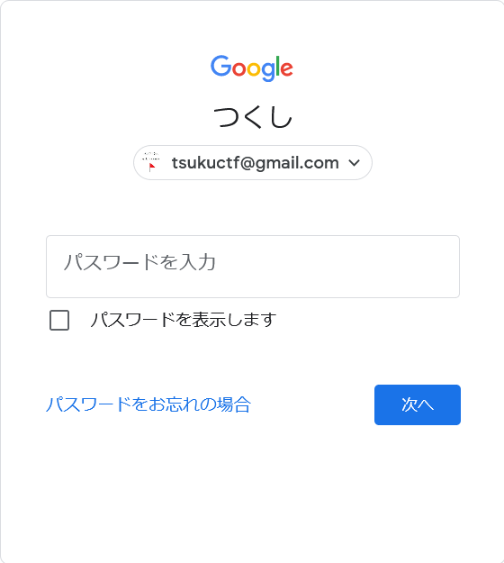

## Tsukushi_no_email1

リンク先に飛ぶと`tsukuctf@gmail.com`がこの CTF のメールアドレスであることがわかる。  
これを用いて Google のログインを途中まで試みると、下のような画面となる。

アイコン部分に何か表示されているのがわかるので、開発者ツールなどで画像を大きめに表示してやる。

flag が書かれていた。  
ちなみに[Tsukushi_no_email2](../tsukushi_no_email2)を用いることでも取得できる。

## TsukuCTF{Google_kingdom}
