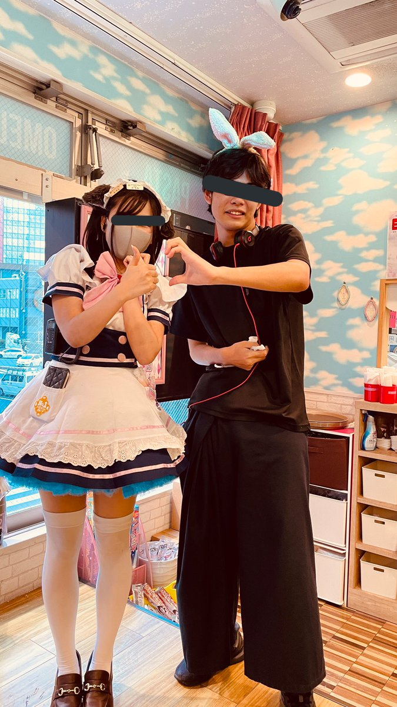

# cafe

> 私の彼氏([@7aru7aru](https://twitter.com/7aru7aru))が最近どうやらメイドカフェにハマっているみたいなんだけど、そのカフェの場所が知りたいの！
> そのお店の公式 HP の URL がフラグです。ただし、もしそのお店がチェーン店の場合は店舗専用 HP の URL がフラグです。
> - **この問題は5回までしか提出できません。**

Twitter検索で「from:7aru7aru メイドカフェ」のような検索を考えますが，なにも出てきません．[from:7aru7aruを画像込みで検索](https://twitter.com/search?q=from%3A7aru7aru&src=typed_query&f=image)で検索するとこの画像が表示されます．



左の女の子のポケットに`No1メイドカフェグループ`と書かれているのでこれを検索するとめいどりーみんというお店が出てきます．制服からあっていることも確信できます．めいどりーみんの公式サイトへ行くと，[メイド一覧](https://maidreamin.com/cast/maid/)が見れます．ここで写真に書かれている「かすみ」さんを検索すると「秋葉原 中央通り店」であることがわかり，URLが手に入ります．ここで，URLとドメインを間違えないようにしてください．

```txt
TsukuCTF{https://maidreamin.com/shop/detail.html?id=5}
```