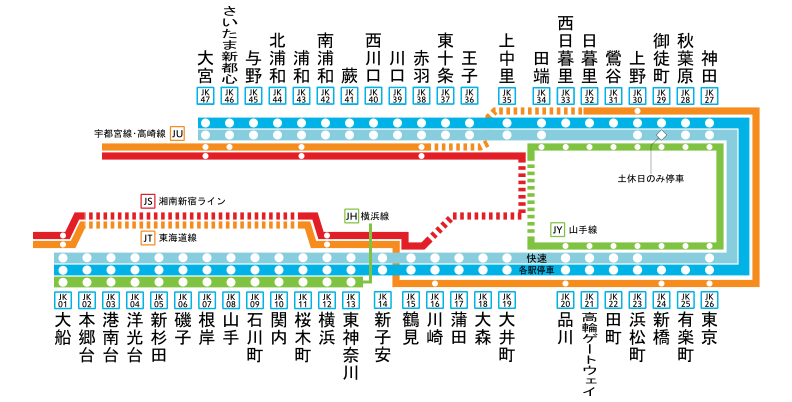

# train

> 画像が撮られた駅名を答えてください。
> - **この問題は5回までしか提出できません。**
> - 駅名は[東京近郊路線図](https://www.jreast.co.jp/map/pdf/map_tokyo.pdf)内に記載されている駅名の英語表記を使用します。
> - 駅名がそのままフラグになります。仮に駅名が`Kyoto`の場合、フラグは`TsukuCTF{Kyoto}`となります。


画像から京浜東北線と山手線の両方が走っている駅だとわかります．


([https://ja.wikipedia.org/wiki/京浜東北線](https://ja.wikipedia.org/wiki/%E4%BA%AC%E6%B5%9C%E6%9D%B1%E5%8C%97%E7%B7%9A) より引用)

路線図より，品川-田端のどれかになります．ここで，画像をよく見ると別のホームでは品川行きの電車があります．つまり今いるホームは田端方面行きです，田端方面行きかつ東京上野方面行きであることがわかるので，品川-有楽町のどれかに絞れます．また，快速が通過していることから新橋または有楽町であることがわかり，北改札があるのは新橋だけです．

```txt
TsukuCTF{Shimbashi}
```