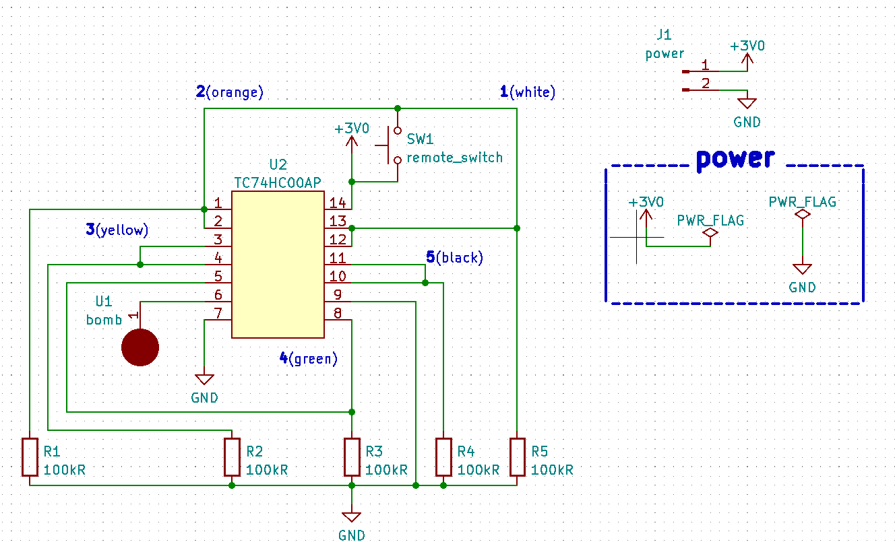

# DefuseBomb

DefBom1.jpg を見ていくと「TC74HC02AP」、「TC74HC08AP」と書いてある部品があるので調べるとそれぞれ 2 入力の NOR ゲート、AND ゲートの IC であることがわかります。しかし、この IC には 14 のピンがそれぞれどのような入出力を行うのか知る必要があるので TC74HC02AP,TC74HC08AP のデータシート(取扱説明書)を入手します(「TC74HC02AP データシート」とかで検索すると入手できます)NAND ゲートについては論理回路やディジタル回路の教科書やサイト等を参考にして下さい。  
あとは 6 つの線それぞれを切断したときに limit_timer が ON、OFF の状態での bomb に信号が流れるかを調べます。4 を切断すると解除成功です。2,3,5 は切断しても limit_timer が ON 状態になると爆発、1,6 は切断した瞬間爆発します。  
ちなみに今回使用されている抵抗はプルダウン抵抗と呼ばれる役割を果たしています（詳細は下記リンク等を参照）  
https://voltechno.com/blog/pullup-pulldown/

DefBom2.jpg の回路図の記号に見覚えのない方は、IRF3205 が N チャンネル MOSFET であることを確認します。
MOSFET についてはアナログ回路や半導体の教科書等を参考にして下さい。
あとは 5 つの線それぞれを切断したときに limit_timer が ON、OFF の状態での bomb に信号が流れるかを調べます。４を切断すると解除成功です。1,2 は切断しても limit_timer が ON 状態になると爆発、3,5 は切断した瞬間爆発します。  
ちなみに DefBom2 は N チャンネル MOS を２つ組み合わせることによってできた NAND ゲートを 4 つ組み合わせた回路になっています。  
https://qiita.com/niQSun/items/251e5824c70724a7d2c0#%E3%81%A7%E3%81%AF2%E5%80%8B%E4%BD%BF%E3%81%A3%E3%81%9F%E3%82%89

DefBom3 は zip ファイルの中に特徴的な拡張子があるので調べると、この zip ファイルはガーバーデータと呼ばれるものだと分かります。ガーバーデータを見る方法としてはオンラインでガーバーデータを閲覧できるサイトで見る or 基板設計ソフトウェアで見るといった方法があります。  
ちなみに昨年の TsukuCTF で「PCB」に取り組まれた方は察しが付いたのではないかと思います。  
あとは「TC74HC00AP」と書いてある謎の部品があるので調べると 2 入力の NAND ゲートの IC であることがわかります。TC74HC00AP のデータシートは下記リンク参照。  
https://akizukidenshi.com/download/ds/toshiba/TC74HC00A.pdf  
NAND ゲートについては論理回路やディジタル回路の教科書、下記のリンク先等を参考にして下さい。  
https://www.maximintegrated.com/jp/glossary/definitions.mvp/term/nand-gate/gpk/1203  
あとは 5 つの線それぞれを切断したときに limit_timer が ON、OFF の状態での bomb に信号が流れるかを調べます。2 を切断すると解除成功です。1,5 は切断しても limit_timer が ON 状態になると爆発、3,4 は切断した瞬間爆発します。また、回路図はこちらのようになります。  

ちなみに DefBom2 と DefBom3 は論理ゲートの回路に描きなおすと実は同じです。（切断する番号だけ変えてます）
`TsukuCTF22{442}`

# 補足

昨年「SECCON Contests」で行われた疑似時限爆弾解除競技「Juggernaut」からヒントを得て作問しました。  
https://www.seccon.jp/2021/seccon_contest/secconcon.html  
https://github.com/Alignof/Juggernaut  
今回のような問題は CTF ではあまり出題されないため、参加者の皆様の中でも賛否が分かれると思います。なので writeup やアンケート等で感想等を書いて頂けると幸いです（この問題に限らずですが
