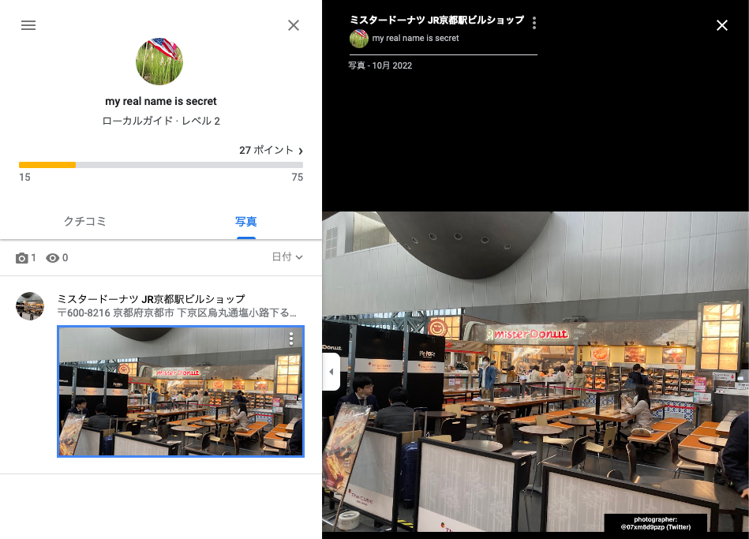

# FlagDM

## Phase 1 (Get Email)

Google ドキュメントの URL が与えられます。Google ドキュメントには作成者に関するさまざまな情報が含まれています。その情報を知る手段として[GHunt](https://github.com/mxrch/GHunt)があります。しかし、GHunt は doc コマンドは[issue にも書かれている通り](https://github.com/mxrch/GHunt/issues/360)、一時的に使用できませんでした(勿論、現時点では使用できる可能性もあります)。

そこで、ここでは[xeuledoc](https://github.com/Malfrats/xeuledoc)を使用します。これは GHunt と殆ど同じコードですが、[Google Internal token](https://github.com/Malfrats/xeuledoc/blob/master/xeuledoc/core.py#L37)の関係で GHunt を使用できない場合でも、こちらは使用できることがあります。

```bash
$ xeuledoc https://docs.google.com/document/d/1y266JcI1E8piugLQDPaK7boSzAKykg4FepQZIOt4Phg

Twitter : @MalfratsInd
Github : https://github.com/Malfrats/xeuledoc

Document ID : 1y266JcI1E8piugLQDPaK7boSzAKykg4FepQZIOt4Phg

[+] Creation date : 2022/10/03 12:18:33 (UTC)
[+] Last edit date : 2022/10/03 12:29:36 (UTC)

Public permissions :
- reader

[+] Owner found !

Name : my real name is secret
Email : mpju40nchoyba85@gmail.com
Google ID : 03458870179467391774
```

このように名前、Email、Google ID などが手に入りました。名前は偽名のようです。しかし、Email が手に入ったのでこれを使用します。

## Phase 2 (Get Twitter)

先ほどの GHunt を用いて、Email から Gaia ID を取得します。

```bash
python3 ghunt.py email mpju40nchoyba85@gmail.com

     .d8888b.  888    888                   888
    d88P  Y88b 888    888                   888
    888    888 888    888                   888
    888        8888888888 888  888 88888b.  888888
    888  88888 888    888 888  888 888 "88b 888
    888    888 888    888 888  888 888  888 888
    Y88b  d88P 888    888 Y88b 888 888  888 Y88b.
     "Y8888P88 888    888  "Y88888 888  888  "Y888

[+] 1 account found !

------------------------------

Name : my real name is secret

[+] Custom profile picture !
=> https://lh3.googleusercontent.com/a-/ACNPEu_leXrOIIzCIna7Jx_LcstS9GGLCDF8HfbnQ-rS
Profile picture saved !

Last profile edit : 2022/10/04 17:21:29 (UTC)

Email : mpju40nchoyba85@gmail.com
Gaia ID : 117114600888142762916

Hangouts Bot : No

[-] Unable to fetch connected Google services.

[-] YouTube channel not found.

Google Maps : https://www.google.com/maps/contrib/117114600888142762916/reviews
[-] No reviews

Google Calendar : https://calendar.google.com/calendar/u/0/embed?src=mpju40nchoyba85@gmail.com
[-] No public Google Calendar.
```

`Gaia ID : 117114600888142762916`と表記されています。また、この箇所に注目してください。

```bash
Google Maps : https://www.google.com/maps/contrib/117114600888142762916/reviews
[-] No reviews
```

この人は Google Map のレビューを投稿していないように見えます。しかし、実際には存在します。[こちら](https://www.google.com/maps/contrib/117114600888142762916/reviews)の「写真」をクリックしてみてください。表示しない設定においても、レビューの写真のみ表示されています。



よく見ると権利表記の Twitter ID が表示されています。`@07xm8d9pzp`

[https://twitter.com/07xm8d9pzp](https://twitter.com/07xm8d9pzp)

プロフィールに Youtube のチャンネルが記載されています。

[https://www.youtube.com/channel/UCZ7_GtoaC4oHCKBLhJi13Ww](https://www.youtube.com/channel/UCZ7_GtoaC4oHCKBLhJi13Ww)

`gross_poem`というユーザ名を使用していることがわかりました。

## Phase 3 (Get Flag)

このユーザ名を用いて、使用している別のサービスを探します。これは、[sherlock](https://github.com/sherlock-project/sherlock)が非常に便利です。

```bash
$ python3 sherlock gross_poem
Update Available!
You are running version 0.14.0. Version 0.14.2 is available at https://git.io/sherlock
[*] Checking username gross_poem on:


[+] Trakt: https://www.trakt.tv/users/gross_poem
[+] koo: https://www.kooapp.com/profile/gross_poem
[+] skyrock: https://gross_poem.skyrock.com/
```

このうち、[Trakt](https://www.trakt.tv/users/gross_poem)を開くと明らかに怪しい Base64 の文字列が表示されています。

`TmljZSEgRmxhZyBpcyBIZXJlISAtPiBUc3VrdUNURjIye000bnlfMFMxTjdfNzAwbHNfM3gxNTd9Cg==`

Base64 をデコードします。

```bash
$ echo "TmljZSEgRmxhZyBpcyBIZXJlISAtPiBUc3VrdUNURjIye000bnlfMFMxTjdfNzAwbHNfM3gxNTd9Cg==" | base64 -d
Nice! Flag is Here! -> TsukuCTF22{M4ny_0S1N7_700ls_3x157}
```

## Flag

`TsukuCTF22{M4ny_0S1N7_700ls_3x157}`

## Tips

実は GHunt でも`resources/data.txt`の`internal`に xeuledoc のトークンを使用すると、正常に動作します。

結果的に変更される箇所はここです。

[https://github.com/mxrch/GHunt/blob/4601d75d6bb12c33a605a7ac5bf88e151e9ba3d3/modules/email.py#L46](https://github.com/mxrch/GHunt/blob/4601d75d6bb12c33a605a7ac5bf88e151e9ba3d3/modules/email.py#L46)

最終的な出力は以下のようになります。

```bash
$ python3 ghunt.py doc https://docs.google.com/document/d/1y266JcI1E8piugLQDPaK7boSzAKykg4FepQZIOt4Phg

     .d8888b.  888    888                   888
    d88P  Y88b 888    888                   888
    888    888 888    888                   888
    888        8888888888 888  888 88888b.  888888
    888  88888 888    888 888  888 888 "88b 888
    888    888 888    888 888  888 888  888 888
    Y88b  d88P 888    888 Y88b 888 888  888 Y88b.
     "Y8888P88 888    888  "Y88888 888  888  "Y888


Document ID : 1y266JcI1E8piugLQDPaK7boSzAKykg4FepQZIOt4Phg

{
  "kind": "drive#file",
  "userPermission": {
    "id": "me",
    "type": "user",
    "role": "reader"
  },
  "parents": [],
  "iconLink": "https://drive-thirdparty.googleusercontent.com/16/type/application/vnd.google-apps.document",
  "shared": true,
  "alternateLink": "https://docs.google.com/document/d/1y266JcI1E8piugLQDPaK7boSzAKykg4FepQZIOt4Phg/edit?usp=drivesdk",
  "fileSize": "31860",
  "copyRequiresWriterPermission": false,
  "permissions": [
    {
      "id": "anyoneWithLink",
      "type": "anyone",
      "role": "reader",
      "withLink": true
    },
    {
      "id": "03458870179467391774",
      "name": "my real name is secret (gross_poem)",
      "type": "user",
      "role": "owner",
      "photoLink": "https://lh3.googleusercontent.com/a-/ACNPEu_leXrOIIzCIna7Jx_LcstS9GGLCDF8HfbnQ-rS=s64",
      "emailAddress": "mpju40nchoyba85@gmail.com",
      "domain": "gmail.com"
    }
  ],
  "id": "1y266JcI1E8piugLQDPaK7boSzAKykg4FepQZIOt4Phg",
  "labels": {
    "starred": false,
    "trashed": false
  },
  "createdDate": "2022-10-03T12:18:33.160Z",
  "modifiedDate": "2022-10-03T12:29:36.221Z",
  "capabilities": {
    "canEdit": false,
    "canComment": false,
    "canAddChildren": false,
    "canDownload": true,
    "canRemoveChildren": false,
    "canRename": false,
    "canMoveItemIntoTeamDrive": false,
    "canMoveItemOutOfDrive": false,
    "canMoveItemWithinDrive": false,
    "canMoveChildrenWithinDrive": false
  }
}

[+] Creation date : 2022/10/03 12:18:33 (UTC)
[+] Last edit date : 2022/10/03 12:29:36 (UTC)

Public permissions :
- reader

[+] Owner found !

Name : my real name is secret
Email : mpju40nchoyba85@gmail.com
Google ID : 03458870179467391774

[+] Custom profile picture !
=> https://lh3.googleusercontent.com/a-/ACNPEu_leXrOIIzCIna7Jx_LcstS9GGLCDF8HfbnQ-rS=s64
Profile picture saved !
```

しかし、このトークンでは doc コマンドしか使用する権限がありません。

## Phase 1 (Get Email)

Google Document URL is provided. Google docs contains many infos related to author. [GHunt](https://github.com/mxrch/GHunt) is a great tool to know those infos. However, GHunt doc command seems not available today according to an [issue](https://github.com/mxrch/GHunt/issues/360) (Of course, you may be able to use it now)
So in this write-up, we'll use [xeuledoc](https://github.com/Malfrats/xeuledoc). Even though this is similar to GHunt, we may be able to use this even though we can't run GHunt because of [Google Internal token](https://github.com/Malfrats/xeuledoc/blob/master/xeuledoc/core.py#L37)

```bash
$ xeuledoc https://docs.google.com/document/d/1y266JcI1E8piugLQDPaK7boSzAKykg4FepQZIOt4Phg

Twitter : @MalfratsInd
Github : https://github.com/Malfrats/xeuledoc

Document ID : 1y266JcI1E8piugLQDPaK7boSzAKykg4FepQZIOt4Phg

[+] Creation date : 2022/10/03 12:18:33 (UTC)
[+] Last edit date : 2022/10/03 12:29:36 (UTC)

Public permissions :
- reader

[+] Owner found !

Name : my real name is secret
Email : mpju40nchoyba85@gmail.com
Google ID : 03458870179467391774
```

We can get Name, Email, and Google ID. The name seems useless. However, we get an e-mail.

## Phase 2 (Get Twitter)

With using GHunt, we can detect Gaia ID from Email.

```bash
python3 ghunt.py email mpju40nchoyba85@gmail.com

     .d8888b.  888    888                   888
    d88P  Y88b 888    888                   888
    888    888 888    888                   888
    888        8888888888 888  888 88888b.  888888
    888  88888 888    888 888  888 888 "88b 888
    888    888 888    888 888  888 888  888 888
    Y88b  d88P 888    888 Y88b 888 888  888 Y88b.
     "Y8888P88 888    888  "Y88888 888  888  "Y888

[+] 1 account found !

------------------------------

Name : my real name is secret

[+] Custom profile picture !
=> https://lh3.googleusercontent.com/a-/ACNPEu_leXrOIIzCIna7Jx_LcstS9GGLCDF8HfbnQ-rS
Profile picture saved !

Last profile edit : 2022/10/04 17:21:29 (UTC)

Email : mpju40nchoyba85@gmail.com
Gaia ID : 117114600888142762916

Hangouts Bot : No

[-] Unable to fetch connected Google services.

[-] YouTube channel not found.

Google Maps : https://www.google.com/maps/contrib/117114600888142762916/reviews
[-] No reviews

Google Calendar : https://calendar.google.com/calendar/u/0/embed?src=mpju40nchoyba85@gmail.com
[-] No public Google Calendar.
```

GHunt says `Gaia ID : 117114600888142762916`.
And this person doesn't seem to provide any Google Map reviews as GHunt says

```bash
Google Maps : https://www.google.com/maps/contrib/117114600888142762916/reviews
[-] No reviews
```

However, (s)he does! Let's click the photo(写真) tab in [this page](https://www.google.com/maps/contrib/117114600888142762916/reviews). Even though the review is set not to display, the photo is displayed.


You can find Twitter ID `@07xm8d9pzp` in the photo.
[https://twitter.com/07xm8d9pzp](https://twitter.com/07xm8d9pzp)

And you'll find YouTube link in Twitter profile.
[https://www.youtube.com/channel/UCZ7_GtoaC4oHCKBLhJi13Ww](https://www.youtube.com/channel/UCZ7_GtoaC4oHCKBLhJi13Ww)

Now this person use `gross_poem` as his account name.

## Phase 3 (Get Flag)

Detect other services based on this user name. [sherlock](https://github.com/sherlock-project/sherlock) is a great tool to do this.

```bash
$ python3 sherlock gross_poem
Update Available!
You are running version 0.14.0. Version 0.14.2 is available at https://git.io/sherlock
[*] Checking username gross_poem on:


[+] Trakt: https://www.trakt.tv/users/gross_poem
[+] koo: https://www.kooapp.com/profile/gross_poem
[+] skyrock: https://gross_poem.skyrock.com/
```

You'll find a very strange Base64 string in [Trakt](https://www.trakt.tv/users/gross_poem)

`TmljZSEgRmxhZyBpcyBIZXJlISAtPiBUc3VrdUNURjIye000bnlfMFMxTjdfNzAwbHNfM3gxNTd9Cg==`

Decode this string and you'll get the FLAG.

```bash
$ echo "TmljZSEgRmxhZyBpcyBIZXJlISAtPiBUc3VrdUNURjIye000bnlfMFMxTjdfNzAwbHNfM3gxNTd9Cg==" | base64 -d
Nice! Flag is Here! -> TsukuCTF22{M4ny_0S1N7_700ls_3x157}
```

## Flag

`TsukuCTF22{M4ny_0S1N7_700ls_3x157}`

## Tips

Actually, GHunt works fine when you specify xeuledoc token at `internal` in `resources/data.txt`.

This will be modified
[https://github.com/mxrch/GHunt/blob/4601d75d6bb12c33a605a7ac5bf88e151e9ba3d3/modules/email.py#L46](https://github.com/mxrch/GHunt/blob/4601d75d6bb12c33a605a7ac5bf88e151e9ba3d3/modules/email.py#L46)

And the result is following

```bash
$ python3 ghunt.py doc https://docs.google.com/document/d/1y266JcI1E8piugLQDPaK7boSzAKykg4FepQZIOt4Phg

     .d8888b.  888    888                   888
    d88P  Y88b 888    888                   888
    888    888 888    888                   888
    888        8888888888 888  888 88888b.  888888
    888  88888 888    888 888  888 888 "88b 888
    888    888 888    888 888  888 888  888 888
    Y88b  d88P 888    888 Y88b 888 888  888 Y88b.
     "Y8888P88 888    888  "Y88888 888  888  "Y888


Document ID : 1y266JcI1E8piugLQDPaK7boSzAKykg4FepQZIOt4Phg

{
  "kind": "drive#file",
  "userPermission": {
    "id": "me",
    "type": "user",
    "role": "reader"
  },
  "parents": [],
  "iconLink": "https://drive-thirdparty.googleusercontent.com/16/type/application/vnd.google-apps.document",
  "shared": true,
  "alternateLink": "https://docs.google.com/document/d/1y266JcI1E8piugLQDPaK7boSzAKykg4FepQZIOt4Phg/edit?usp=drivesdk",
  "fileSize": "31860",
  "copyRequiresWriterPermission": false,
  "permissions": [
    {
      "id": "anyoneWithLink",
      "type": "anyone",
      "role": "reader",
      "withLink": true
    },
    {
      "id": "03458870179467391774",
      "name": "my real name is secret (gross_poem)",
      "type": "user",
      "role": "owner",
      "photoLink": "https://lh3.googleusercontent.com/a-/ACNPEu_leXrOIIzCIna7Jx_LcstS9GGLCDF8HfbnQ-rS=s64",
      "emailAddress": "mpju40nchoyba85@gmail.com",
      "domain": "gmail.com"
    }
  ],
  "id": "1y266JcI1E8piugLQDPaK7boSzAKykg4FepQZIOt4Phg",
  "labels": {
    "starred": false,
    "trashed": false
  },
  "createdDate": "2022-10-03T12:18:33.160Z",
  "modifiedDate": "2022-10-03T12:29:36.221Z",
  "capabilities": {
    "canEdit": false,
    "canComment": false,
    "canAddChildren": false,
    "canDownload": true,
    "canRemoveChildren": false,
    "canRename": false,
    "canMoveItemIntoTeamDrive": false,
    "canMoveItemOutOfDrive": false,
    "canMoveItemWithinDrive": false,
    "canMoveChildrenWithinDrive": false
  }
}

[+] Creation date : 2022/10/03 12:18:33 (UTC)
[+] Last edit date : 2022/10/03 12:29:36 (UTC)

Public permissions :
- reader

[+] Owner found !

Name : my real name is secret
Email : mpju40nchoyba85@gmail.com
Google ID : 03458870179467391774

[+] Custom profile picture !
=> https://lh3.googleusercontent.com/a-/ACNPEu_leXrOIIzCIna7Jx_LcstS9GGLCDF8HfbnQ-rS=s64
Profile picture saved !
```

Only `doc` command is available with this token.
