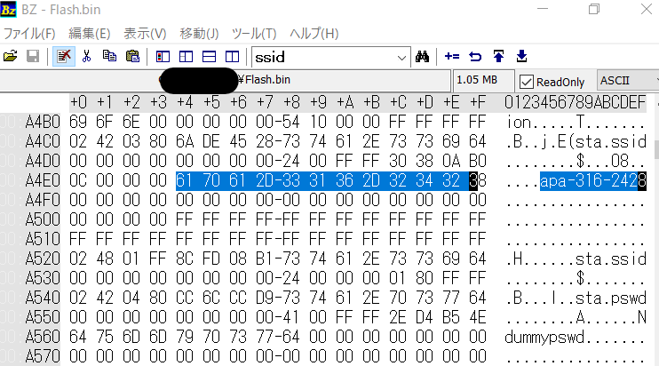

# Flash

ESP32の特徴としてWi-Fiに接続することができます。Wi-FiのSSIDには建物の名前やその一部が用いられることもあるので、とりあえずWi-Fiの接続情報がないかを調べます。  
バイナリエディタで配布されたデータを開いて"ssid"とかで検索すると`apa-316-2428`という文字列が確認できるので恐らくこれがSSIDであることが分かります。
  

SSIDにはホテル名やその一部がSSIDに含まれる可能性を考慮すると"apa"はホテルの名称を表していると推測します。（察しの良い方はこれがアパホテルを示しているということが分かると思います。）  
また"316"、"2428"のどちらかが部屋番号の可能性があり、部屋番号ではない方の数字はホテルの詳細な情報を知る手掛かりになりそうです。そこで`apa 316`とか`apa 2428`で検索をかける。
 

すると`apa 316`の検索結果の上位にNo.316 アパホテル&リゾート〈両国駅タワー〉がヒットした。
どうやら316はホテルのナンバー、2428は部屋番号のようだ。
形式と一致するので、指定されたとおりに組み合わせるとflagとなった。

`TsukuCTF22{アパホテル&リゾート〈両国駅タワー〉_2428}`

# 補足

今回はESP32開発ボードのフラッシュメモリから読みだしたデータを題材にしました。そのため、OSINTジャンルですがHardwareの知識がちょこっとだけ必要になります。ESP32では過去に接続したWi-FiのSSIDとパスワードがマイコン内のフラッシュメモリに残ります。（なお、今回配布したファイルに書かれているパスワード"dummypswd"はこちらで書き換えたものです。）そのため他人にESP32(M5stackなども)を貸すときはフラッシュメモリのデータを消去してから貸し出す必要があります。  
私も私物のESP32でフラッシュメモリの中身を読み出したら、以前所属していた研究室やサークルのWi-Fi接続情報が出てきて懐かしさを覚えました笑  
皆さんも他人にマイコンを貸すときはお気をつけ下さい。  
  
フラッシュメモリの消去、読み出しについては以下のサイトが参考になります。  
https://lang-ship.com/blog/work/esp32-esptool-py/#toc9