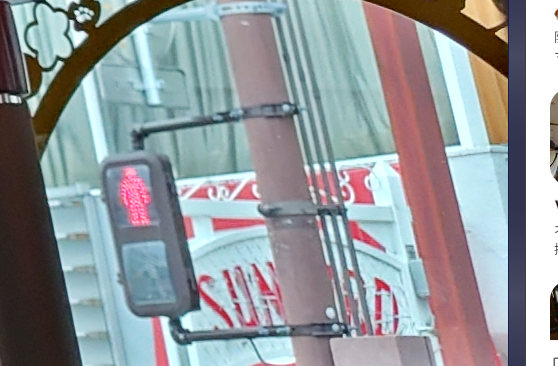
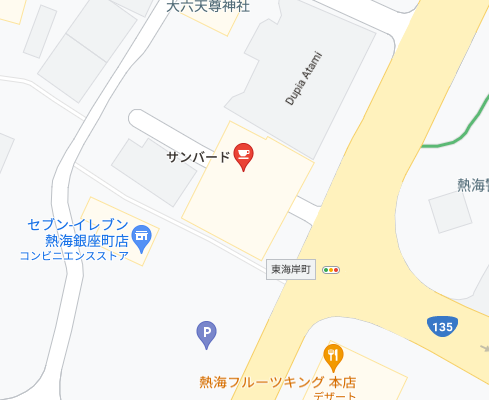

# GorgeousInteriorBus

Google Lensで検索すると、このサイトが出てくる。
https://trafficnews.jp/photo/94601

「湯～遊～バス」という名前らしいので、運航ルートを検索。
https://www.tokaibus.jp/rosen/yu_yu_bus.html

バスのディスプレイより、3つ先のバス停が「●●あたみ」であることがわかるので、次のバス停は「銀座」であることがわかる。

ここで、右のSUNから始まる標識に注目する。

「熱海銀座 SUN」で画像検索をするとこの記事が見つかる。
https://co-trip.jp/post/386495/

「SUNBIRD」という名前らしい。

最後にGoogle Mapで「熱海銀座 SUNBIRD」と検索すると該当する場所がわかる。

https://www.google.com/maps/@35.0972403,139.0751569,3a,75y,214.08h,88.02t/data=!3m6!1e1!3m4!1sljR0wiW1HTrTToG0mgpQSQ!2e0!7i16384!8i8192

`TsukuCTF22{東海岸町}`