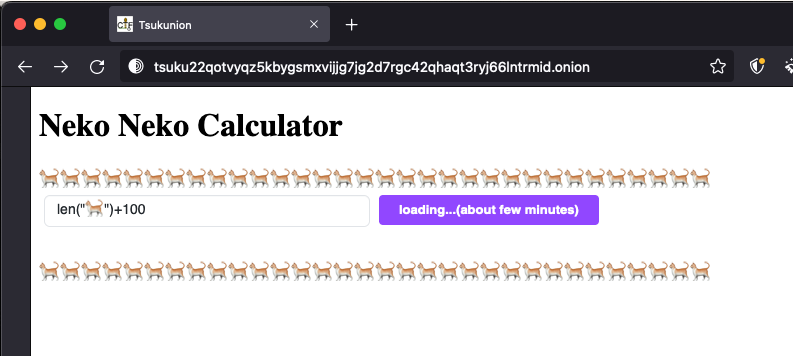
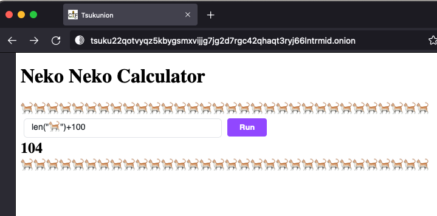
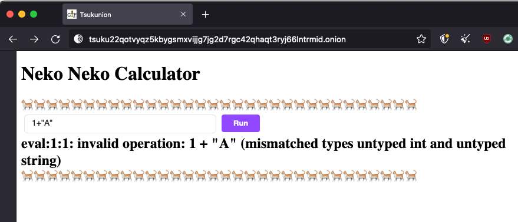
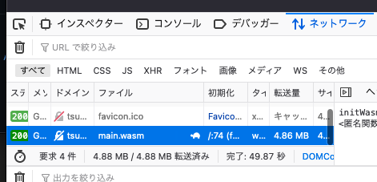
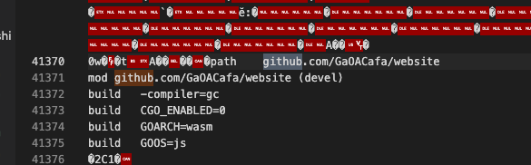
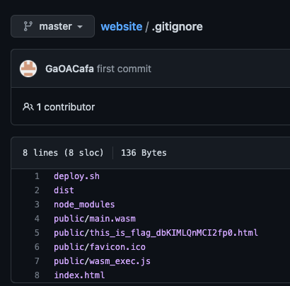
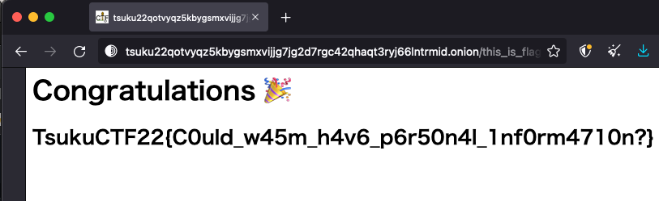

# Ochakumi

問題文に記載されたリンクはonionドメインになっています。よってTorブラウザなど特定のブラウザを使ってアクセスする必要があります(onion.wsなどを使用する方法もあります)。

実際にアクセスしてみると、このような画面になっています。



このWebサイトは計算機として遊ぶことができます。しかし、lenなどの特殊な関数も使用できるようです。



次はエラーを出させてみます。このように入力すると、Go言語のエラー文が出力されます。他にもいくつかのエラーを出力させてみると良いでしょう。



次に、ネットワークタブを開いてみます。すると、WASMとしてGoが実行されていることがわかります。



---

WASMをダウンロードして調査します。

tsuku22qotvyqz5kbygsmxvijjg7jg2d7rgc42qhaqt3ryj66lntrmid.onion/main.wasm

ところで、Goはパッケージが外部に公開されている場合、go.modファイルにレポジトリ情報が高確率で存在します(ただし、Go Modulesの規約としては必ずしもここをURLにする必要はありません)。

> Typically, a module path consists of a repository root path, a directory within the repository (usually empty), and a major version suffix (only for major version 2 or higher).[[ref]](https://go.dev/ref/mod#go-mod-file-ident)

また、GoでWasmを作成した場合、go.modのmodulesの値がそのままWASMの中に反映されます。その結果、modulesをレポジトリにしている場合はレポジトリ名が判明します。

実際にWASMの中を見てみると、githubのレポジトリのようなものがあります。`strings main.wasm | grep "github"`などでも確認することができます。



[https://github.com/GaOACafa/website/](https://github.com/GaOACafa/website/)

このレポジトリを調査すると、興味深いパスが見えます。



```txt
public/this_is_flag_dbKIMLQnMCI2fp0.html
```

このレポジトリはViteで作成されているので、先頭のpublicは削除して、以下のリンク先にアクセスします。

```txt
tsuku22qotvyqz5kbygsmxvijjg7jg2d7rgc42qhaqt3ryj66lntrmid.onion/this_is_flag_dbKIMLQnMCI2fp0.html
```



## `TsukuCTF22{C0uld_w45m_h4v6_p6r50n4l_1nf0rm4710n?}`

余談: 最初はViteでもう少しリッチな感じで作ろうと思っていたのですが、間に合いませんでした🙇‍♂️
