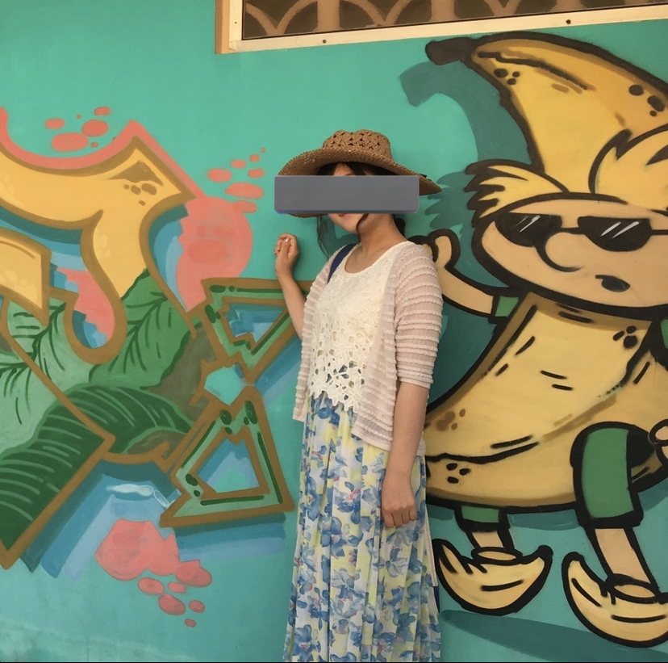
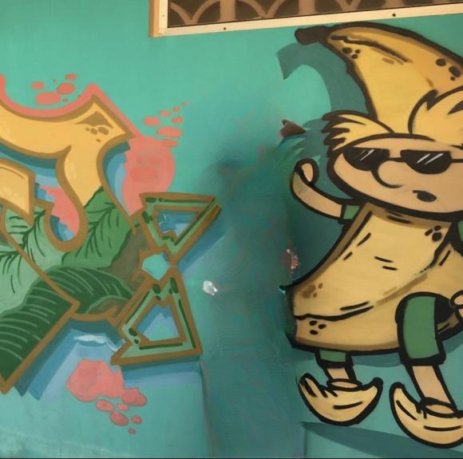
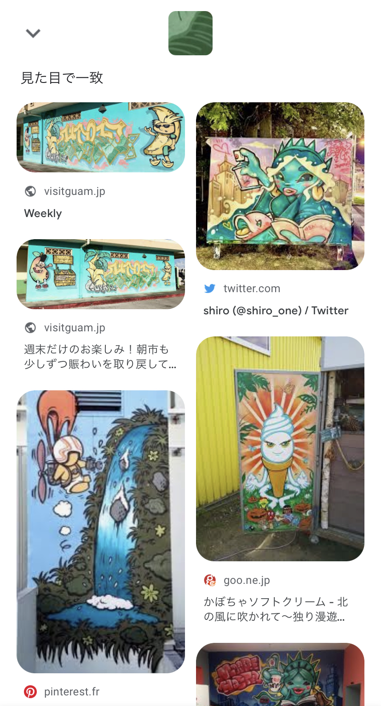

# banana

## 問題文

つくし君は、ある女の子の SNS アカウントを眺めています。  
つくし「この場所を特定して僕も同じ場所の同じ構図で写真を撮りたい！」

つくし君の願いを叶えるべく、この場所を特定してあげましょう。

## 解法

### 1. 人間を消して Google lens へ...

OSINTer 御用達ツール「Google lens」の登場です.  

しかし，問題に掲載されている写真を Google lens で検索してもヒットしません.

そこで紹介したいのがこのツール！  
[https://cleanup.pictures/](https://cleanup.pictures/)  
このツールは，文字や人間などを写真から消し去ってくれるものです.  
そこで人間を消してみると...  

  
元画像と同じバナナのウォールアートがヒットし,撮影場所はグアムと特定できました.  
そこからは複数の解き方がありますが，一例としては「グアム　ウォールアート」などで検索すると  
[https://www.lealea-guam-jp.info/feature/wallart/](https://www.lealea-guam-jp.info/feature/wallart/)

撮影場所は「デデド朝市のトイレ」だと特定できます．
そしてデデド朝市の緯度経度を Google maps で検索することでこの問題を解くことができます．

## 作問者コメント

人間を消せるツール，運営同士の問題レビュー会で作問者は初めて知りました．  
ちなみに人間を背景のエメラルドグリーンに似た色で塗りつぶすだけでは Google lens にヒットしないという声もありました．

`TsukuCTF22{13.521[012]_144.828[56789]}`
`TsukuCTF22{13.520[89]_144.828[56789]}`
