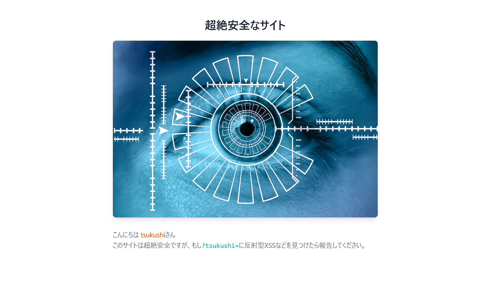

# bughunter

## 問題文

天才ハッカーのつくし君は、どんなサイトの脆弱性でも見つけることができます。 あなたも彼のようにこのサイトの脆弱性を見つけることができますか？ 見つけたら私たちに報告してください。  
`※ディレクトリの総当たりなどは禁止されています。本問題の解決には、多数のリクエストは不要です。`  
[http://133.130.103.51:31415](http://133.130.103.51:31415/)

## 難易度

**easy**

## 作問にあたって

初心者向け CTF ということもあり、超簡単な Web 問を出したいと思っていました。  
`/robots.txt`の代わりにシナリオに沿った`/.well-known/security.txt`を選びました。  
タグに`RFC9116`とヒントがあるのに XSS の質問が無限回来ました(当初は`guess`しかタグがありませんでしたが開催日にやさしさが芽生えました)。

## 解法

URL が渡されているのでアクセスすると、以下のような超絶安全なサイトのようだ。  
  
ソースを見るが以下のバーボンハウスのコメントしかない。

```html
~~~
<!--
やあ （´・ω・｀)
ようこそ、バーボンハウスへ。
このテキーラはサービスだから、まず飲んで落ち着いて欲しい。

うん、「また」なんだ。済まない。
仏の顔もって言うしね、謝って許してもらおうとも思っていない。

でも、このコメントを見たとき、君は、きっと言葉では言い表せない
「Flag」みたいなものを感じてくれたと思う。
殺伐とした世の中で、そういう気持ちを忘れないで欲しい
そう思って、このコメントを書いたんだ。

じゃあ、注文を聞こうか。
-->
~~~
```

クエリパラメータ`?tsukushi=`に反射型 XSS があるが、クローラなどはないので cookie などを盗む問題でないと考えられる。  
`反射型XSSなどを見つけたら報告してください。`とあることからも脆弱性を報告すればよいようだ。  
ここで報告先がわからないが、そのような場合 RFC9116 に`/.well-known/security.txt`を見ればよいと記述されている。

```bash
$ curl http://133.130.103.51:31415/.well-known/security.txt
Contact: TsukuCTF22{y0u_c4n_c47ch_bu65_4ll_y34r_r0und_1n_7h3_1n73rn37}
Expires: 2022-10-20T15:00:00.000Z
Preferred-Languages: ja, en
```

見てやると Contact に flag が書かれていた。

## TsukuCTF22{y0u_c4n_c47ch_bu65_4ll_y34r_r0und_1n_7h3_1n73rn37}
