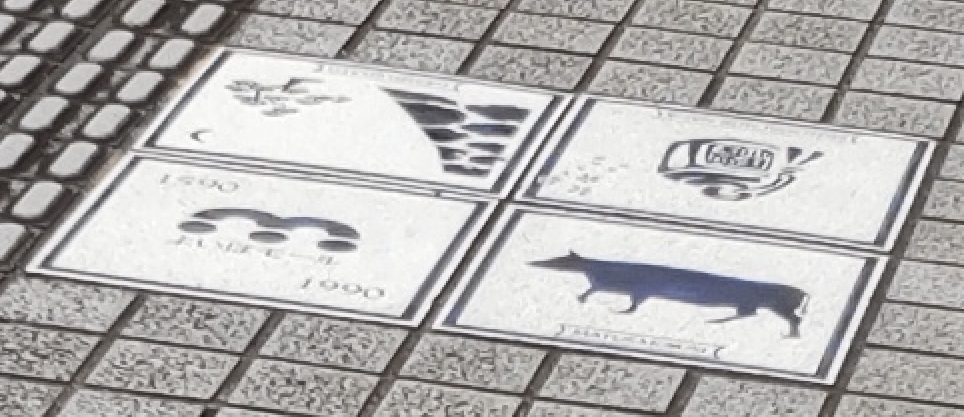
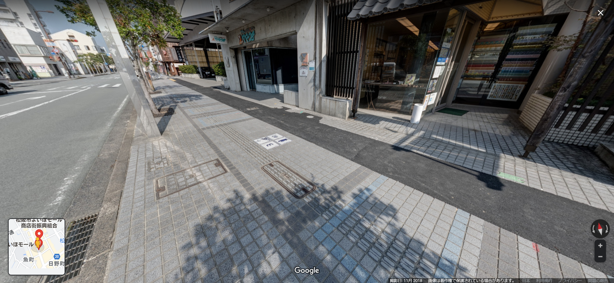

# douro

## 問題文
旅行中のつくし君は迷子になってしまったようです。うつむいています。送られてきた写真から場所を特定できますか？  
`※フラグの形式はTsukuCTF22{緯度_経度}です。ただし、緯度経度は十進法で小数点以下五桁目を切り捨てたものとします。`  

[douro.jpg](files/douro.jpg)  

## 難易度
**easy**  

## 作問にあたって
ただの道を問題にしました。  
松坂はいいところです。  
この写真の近くにある、不二屋の**やきそば**が美味しいです。  

## 解法
謎の道の写真が配布される。  
  
拡大するとタイルに何か書かれている。  
  
`よいほモール`と書かれているようなので、「よいほモール タイル」でGoogle検索すると、三重県松阪市の商店街がヒットする。  
あとはGoogleマップでタイルの地点の緯度経度を探せばよい。  
いい位置で写真が取られている。  
  
緯度経度を指定された形式にすると、flagとなった。  

## TsukuCTF22{34.5763_136.5313}