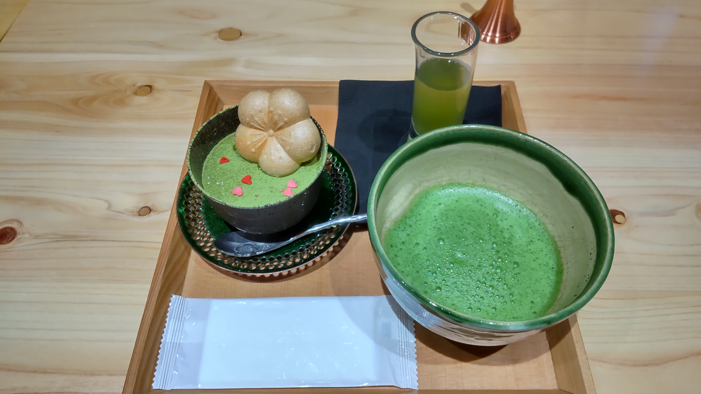
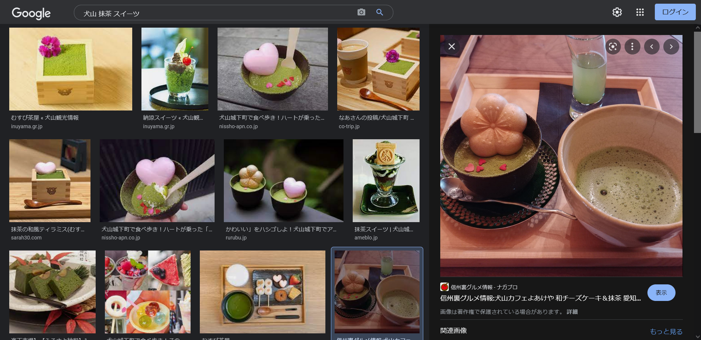
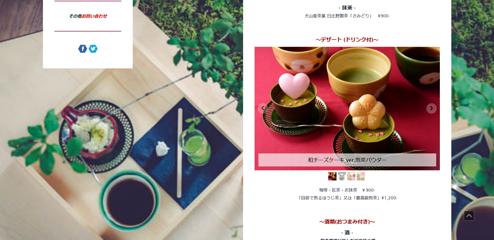

# inuyama082

## 問題文
つくし君は愛知県犬山市にデートに来た時の思い出の写真を見返しています。 おいしそうな写真を見つけ、おやつが食べたくなりました。 写真のおやつの名前を教えてください。  
`※フラグの形式はTsukuCTF22{XXXXXXX ver.XXXXXX}です。`  

[inuyama082.jpg](files/inuyama082.jpg)  

## 難易度
**easy**  

## 作問にあたって
CTFの作問では飯テロを心がけているのですが、今回はスイーツにしました。  
数分で解ける難易度を想定していましたが、死ぬほどフラグ形式の質問が来ました(なんで？)。  

## 解法
抹茶がついている特徴的なスイーツの写真が渡される。  
  
`愛知県犬山市`と問題文にあることから、「犬山 抹茶 スイーツ」とGoogle画像検索する。  
すると以下のように、同じものが見つかる。  
  
これらから`よあけや`というカフェであることがわかるため、「犬山 よあけや」でGoogle検索すると[公式サイト](https://www.yoakeya1916.com/)が見つかる。  
カフェメニューを見てやると、写真と全く同じものが掲載されていた。  
  
この商品名`和チーズケーキ ver.煎茶パウダー`を形式通りにするとflagとなった。  

## TsukuCTF22{和チーズケーキ ver.煎茶パウダー}