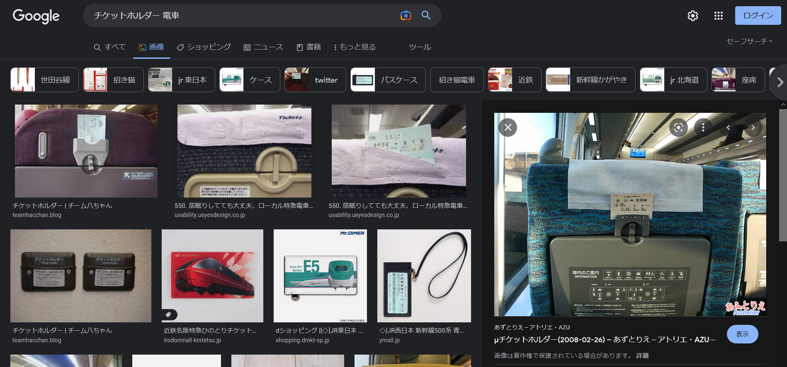

# sky

## 問題文
帰ってくるあなたが最高のプレゼント。つくし君は電車にガタゴト揺られています。次の停車駅で降りるようなのですが、どこかわかりますか？  
`※フラグの形式はTsukuCTF22{次の停車駅}です。公式サイトの表記を採用します(スペースは含めません)。`  

[sky.jpg](files/sky.jpg)  

## 難易度
**easy**  

## 作問にあたって
電車を使った問題です。  
ちなみにクリスマス・エクスプレスの「帰ってくるあなたが最高のプレゼント」の撮影は大部分が名古屋駅14番ホームらしいです。  
そしてJR東海です。  

## 解法
電車の画像が渡される。  
  
前の座席が特徴的なので「チケットホルダー 電車」でGoogle画像検索を行う。  
  
同様の形状の座席がヒットし、`μチケットホルダー`からミュースカイであることがわかる。  
「ミュースカイ 駅」でGoogle検索を行うと、[名古屋本線｜路線・駅情報｜電車のご利用案内｜名古屋鉄道](https://www.meitetsu.co.jp/train/station_info/line01/)で停車駅がわかる。  
案内の窓の映り込みから`M......`から始まっているとも読めるので、名鉄名古屋が次の駅だとわかる(停車駅をすべて試してもよい)。  

## TsukuCTF22{名鉄名古屋}