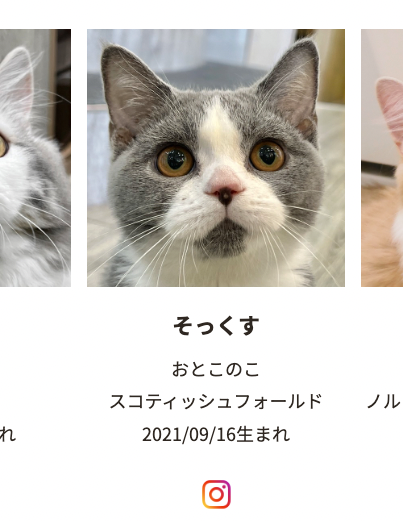

# uTSUKUSHIi

「猫カフェ ソファ 黄色」で検索すると、床の色で場所が特定できる。この写真が猫カフェで撮られたことは光の加減やソファの配色、段差などから推測できる。
[https://catmocha.jp/shop/kawaramachi/](https://catmocha.jp/shop/kawaramachi/)

上記のWebサイトの猫ちゃんの写真から、名前がそっくすくんであることがわかる。その下に誕生日が書かれているため、これがフラグとなる。

本当に写真の猫と一致しているか不安なら、すぐ下に表示されているインスラグラムの投稿を見ると良い。

[instagram](https://www.instagram.com/explore/tags/mocha%E3%81%9D%E3%81%A3%E3%81%8F%E3%81%99/)

## `TsukuCTF22{2021/09/16}`