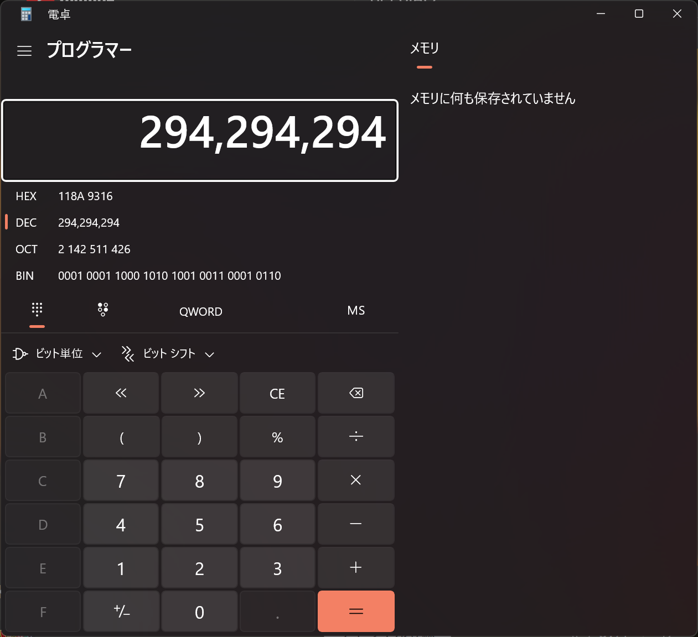
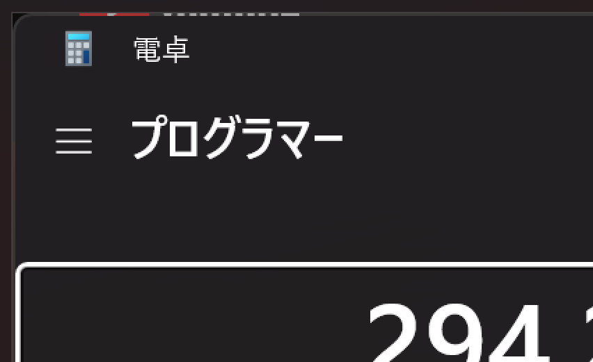

# CtrlAltPrtSc

## 問題文
仕事中にCtrl + Alt + PrtScでウィンドウのスクリーンショットを撮ったよ。  

つくし君がサボって使用していたサービスの名前を答えよ。 フラグは`TsukuCTF23{サービスの名前}`の形式です。  

[CtrlAltPrtSc.png](files/CtrlAltPrtSc.png)  

## 難易度
**easy**  

## 作問にあたって
以前よりCtrl + Alt + PrtScで取得したスクリーンショットに背景の情報が含まれている仕様？が気になっていました。  
フォントなどが分かっている場合、おそらくビットパターンで文字列を再構成できます。  
当初は何の動画を見ているか当てる問題でしたが、誰も解けなかったため アーティストの特定 → サービスの特定 になりました(分かった方はWriteUpに……)。  
他人に渡すスクリーンショットに知られたくない情報が含まれていないか注意です。  
ちなみに出題後にCtrlが不要なことを知りました(Satokiが小学生のころ友人に教えてもらった思い出のキー組み合わせ)。  
今までのCtrlを返して。  

## 解法
電卓のスクリーンショットが渡される。  
  
仕事中のスクリーンショットのようで、サボって何らかのサービスを使っているようだ。  
ここでスクリーンショットの縁に謎の色が表示されているのに気づく。  
  
後ろのウィンドウの色情報が含まれているようで、YouTubeのロゴに見える。  
どうやら仕事中にサボって動画を見ていたようだ。  
サービスの名前である`YouTube`を指定された形式に整形するとflagであった。  

## TsukuCTF23{YouTube}
