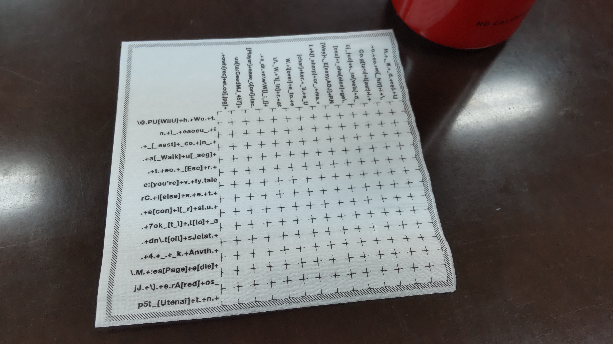
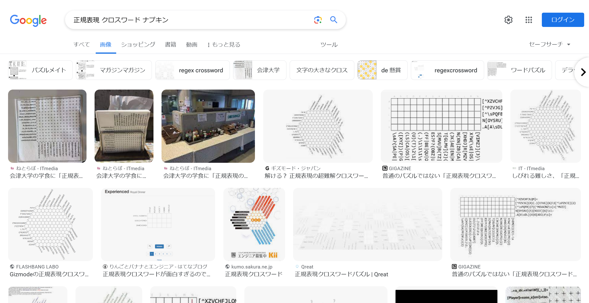
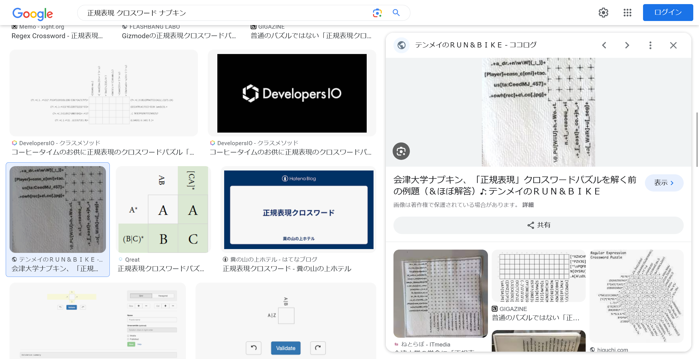
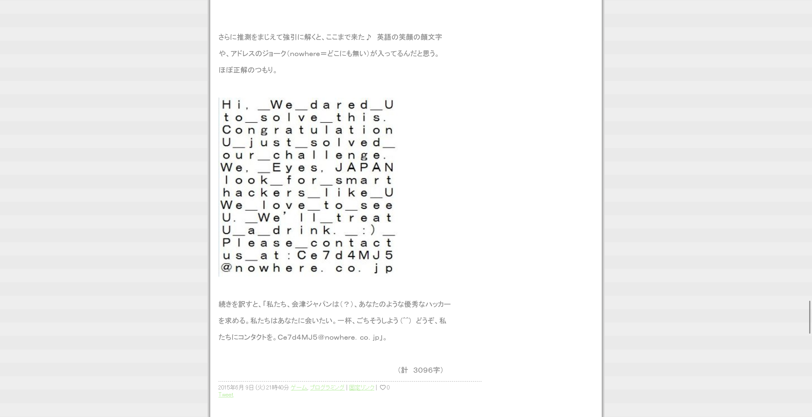

# RegexCrossword

## 問題文
クロスワードを解いてみて!  
これを作った会社の本社の郵便番号をハイフンありで答えてね!!  

## 難易度
**easy**  

## 作問にあたって
Regexの面白いクロスワードがあったので問題にしました。  
思ったよりネット上に話題がなくて驚きました(がOSINTにちょうどよかったです)。  
当たり前ですが、クロスワードを頑張って解いても答えが得られます。  

## 解法
謎のデザインのナプキンの画像が与えられる。  
  
「正規表現 クロスワード ナプキン」でGoogle画像検索を行う。  
  
`会津大学`の学食に設置されていたことがわかる。  
さらに検索結果を見ていくと、[クロスワードを解いた記事](https://tenmei.cocolog-nifty.com/matcha/2015/06/post-d9ac.html)が見つかる。  
  
記事の最後に解答が記載されており、`Ｃｅ７ｄ４ＭＪ５＠ｎｏｗｈｅｒｅ．ｃｏ．ｊｐ`とある。  
  
このメールアドレスのドメイン`nowhere.co.jp`にアクセスすると`株式会社 Eyes, JAPAN`が作成しているようだ。  
[会社概要](https://www.nowhere.co.jp/company/summary/)から本社の郵便番号が`965-0872`であるとわかる。  
指定された形式に整形するとflagとなった。  

## TsukuCTF23{965-0872}