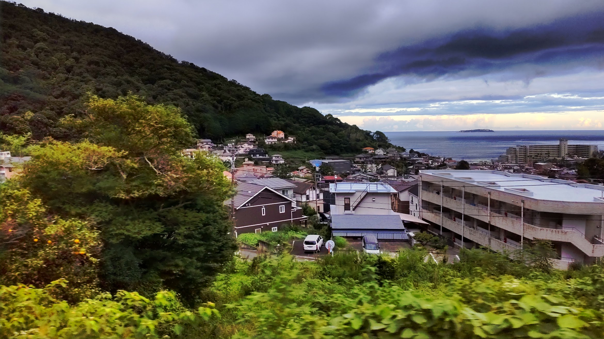
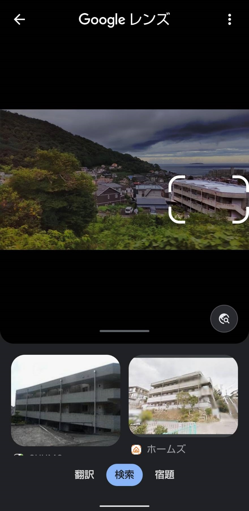
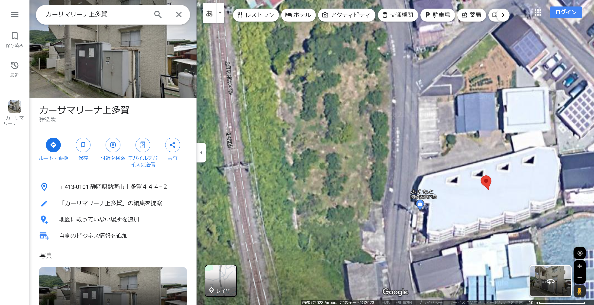

# TrainWindow

## 問題文
夏、騒音、車窓にて。  

フラグのフォーマットは、`TsukuCTF23{緯度_経度}`です。  
緯度経度は小数第五位を切り捨てとします。  

[TrainWindow.jpg](files/TrainWindow.jpg)  

## 難易度
**easy**  

## 作問にあたって
Googleレンズで特徴的な一部を選択するとヒットする問題です。  
たまには電車に揺られてゆっくりするのもいいですよね。  

## 解法
車窓からの風景画像が与えられる。  
  
風景には特徴的なランドマークなどは見られない。  
ひとまず画像をGoogleレンズに投げてみるも、有効な結果は得られないように見える。  
ここで、画像右側の最も大きく見える建物が少し特徴的であることに気づくので、Googleレンズで建物を選択する。  
  
同じ建物らしき写真がヒットし、`カーサマリーナ上多賀`であることがわかる。  
Googleマップで見ると、近隣の駐車場の形状や建物の屋根の色が同一であり、近くに線路があることがわかる。  
  
視点が同じになるであろう線路上の点を選択すると緯度経度が`35.064198, 139.066478`である。  
指定された精度、形式に整形するとflagとなった。  

## TsukuCTF23{35.0641_139.0664}
