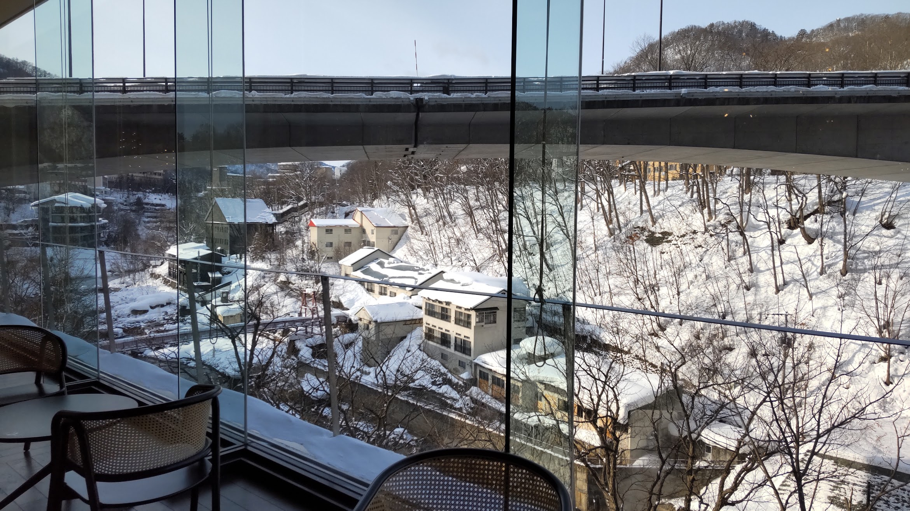
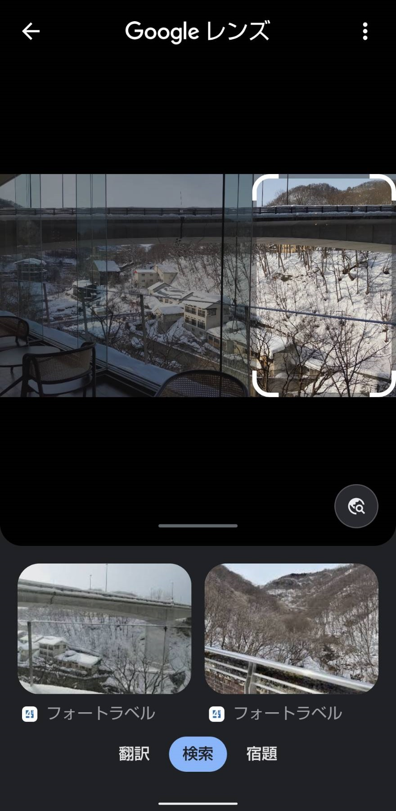
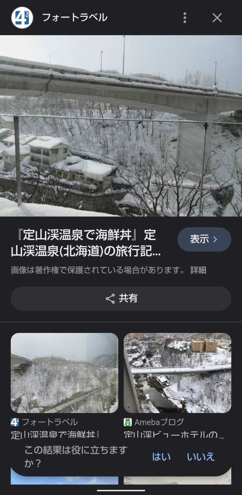
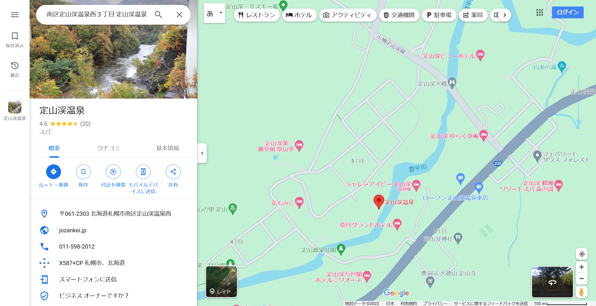
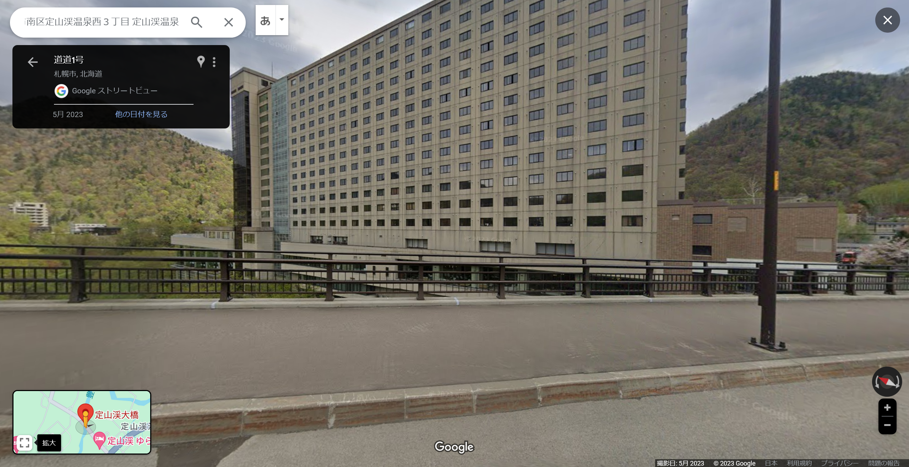

# Yuki

## 問題文
雪、無音、窓辺にて。  

フラグのフォーマットは、`TsukuCTF23{緯度_経度}`です。  
緯度経度は小数第四位を切り捨てとします(精度に注意)。  

[Yuki.jpg](files/Yuki.jpg)  

## 難易度
**easy**  

## 作問にあたって
Googleレンズで出にくい写真を選びました。  
余談ですがかなり良いホテルだったのでおススメです。  

## 解法
雪が積もった風景の画像が与えられる。  
  
Googleレンズで選択個所を調整して検索すると、橋やガラス張りの風景がヒットする。  
うまくガラスの影響がないように右三分の一を選択してやる。  
  
中央の建物が移りこんでいる画像がヒットする。  
  
`定山渓温泉`であることがわかる。  
Googleマップで周辺の橋を調査してやると`定山渓大橋`が目に付く。  
  
配布された画像は橋より少し視点が低いことが見て取れる。  
橋の上から周囲を見渡すと、少し下にガラス張りのスポットが発見できる。  
  
どうやら`定山渓ビューホテル`内部の`カフェ サンリバー`らしい。  
緯度経度は`42.9688126, 141.166956`であることがわかるので、指定された精度、形式に整形するとflagとなった。  

## TsukuCTF23{42.968_141.166}
