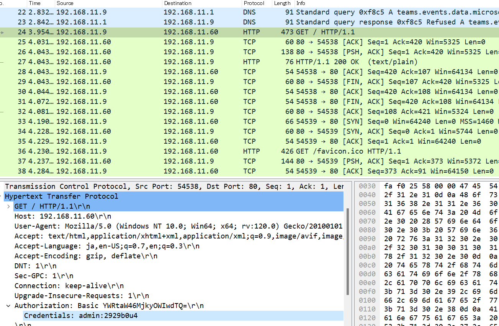

# basic
## 問題文
"保護されていない通信ではパスワードはまる見えダゾ！  
e.g. パスワードが Passw0rd! の場合、フラグは `TsukuCTF23{passw0rd!}` となります。" 
## 難易度
easy 
## 解法
クライアント(192.168.11.9)からサーバ(192.168.11.60)にアクセスした際のキャプチャデータが渡されます。  
27番目のパケットを見るとサーバからクライアントに対して200応答が返ってきているのがわかるので、直前にGETリクエストを送信している24番目のパケットに着目します。  
Authorization ヘッダの Credential を確認すると admin:2929b0u4 という文字列が得られます。  
 
Authorization ヘッダにも Basic と書かれているように認証には Basic 認証が使われています。また、Basic 認証ではユーザ名とパスワードを組み合わせたものが Authorization ヘッダにセットされることからユーザ名：admin、パスワード:2929b0u4 であることが分かります。  
`TsukuCTF23{2929b0u4}`