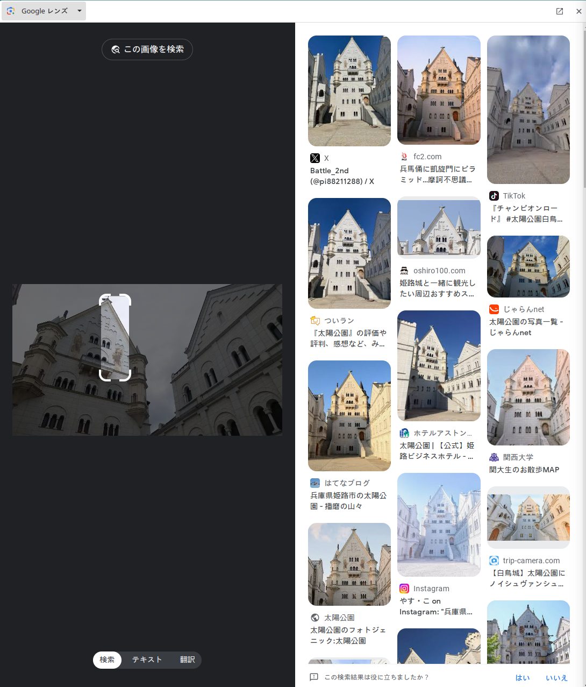

# castle
### 問題文
写真に写っているお城の名前を調べてほしい。

### 難易度
easy

## 解法
1. この画像をGoogleレンズにかけるとノイシュヴァンシュタイン城が出てくる。だが、写真左上のお城の模様を細かく見ると、ノイシュヴァンシュタイン城ではないことがわかる。
2. 得に右側の模様が違うので、そこに絞りGoogleレンズをかける。すると①のような出力となる。
①

3. 模様を良く見ると、白鳥城と同じである。よって、白鳥城であることがわかる。
