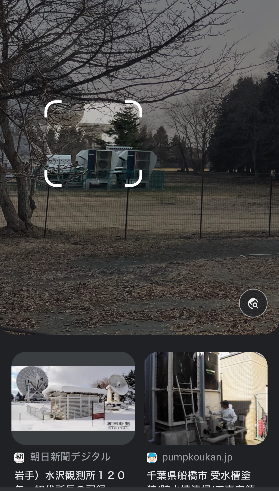

# grass_court
## 問題文
しばらく使われていないテニスコートのようだ。この日本にあるテニスコートの場所はどこだろう。フラグの形式は TsukuCTF23{緯度_経度}です。  
Looks like a tennis court that hasn't been used for a while. Where is the location of this tennis court in Japan? The format of the flag is TsukuCTF23{latitude_longitude}. 
## 難易度
hard
## 解法
Google lensやブラウザを使っても中々出てこないと思います。注目すべきは写真左奥に見える白くて大きな物体です（木の枝に隠れて見づらいですが）  
白い物体の正体を知るために画像のように範囲選択して Google lens で検索してみます。コツとしては木の枝あまりが入りこまないように範囲選択して下さい。（下図参照）木の枝が写っていると木に関する検索がされてしまいます。  
  
すると、検索結果に白い物体によく似たものがヒットすると思います。そしてこれは電波望遠鏡だということが分かります。巨大な電波望遠鏡が設置している場所は数多くないので総当たりしてもいいですし、今回の場合は先頭に水沢天文台がヒットしているので試しに水沢天文台の敷地内にテニスコートがないか航空写真で見てみます。  
テニスコートを見つけることができたら、あとは電波望遠鏡との位置関係を基に緯度と経度を探し出します。  
  
補足：このテニスコートは水沢天文台の元所長（Z項の発見に貢献）である木村栄氏が利用していたテニスコートらしいです。   
`TsukuCTF23{39.134[89]_141.132[23456]}`  
`TsukuCTF23{39.1350_141.132[23456]}" `