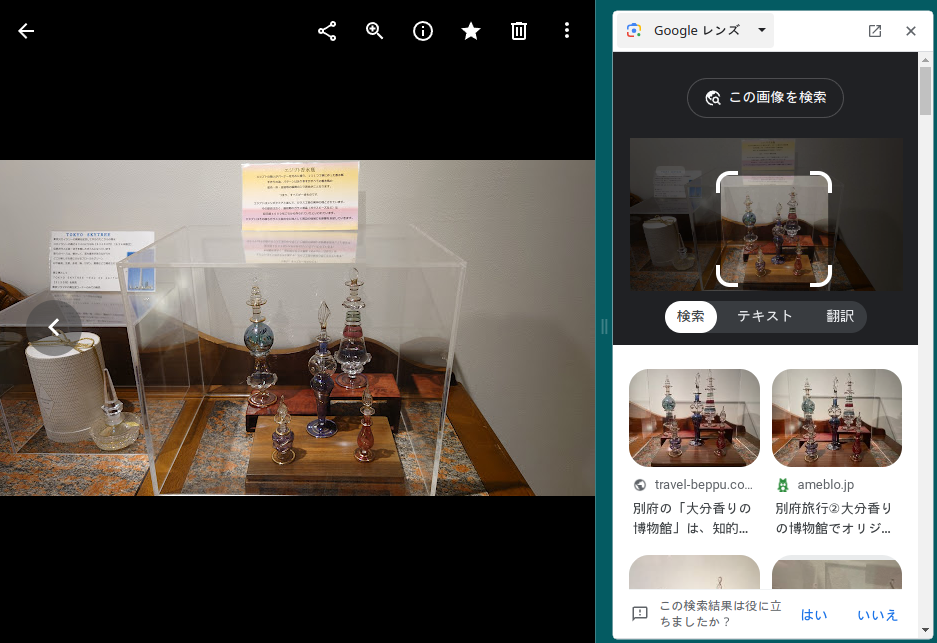

# perfume
## 問題文
とある施設でいろいろな香水を見かけたが、施設の場所が思い出せない。 この施設の場所を調べ、教えてほしい。  

フラグは`TsukuCTF23{緯度_経度}`であり、小数点第三桁まで有効である。  

## 難易度
easy

## 解法
1. 写真をGoogle Lensへかける。
2. Googole Lensでは全体にフォーカスがあっていると、どの施設であるか一意にわからない。

3. エジプトの香水にフォーカスをして、Google Lensをかけると「大分香りの博物館」であることがわかる。

