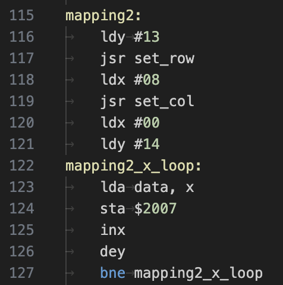
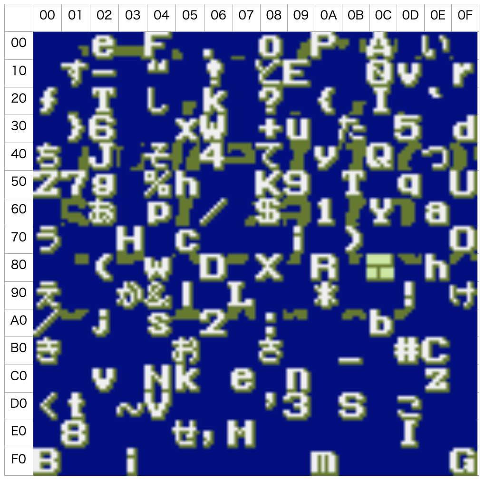

# title_screen
## 問題文
父は昔プログラマーだったらしい、  
しかし、当時開発したソフトのタイトルが思い出せない。  
ソフトを起動すると画面にタイトルが表示されるらしいのだが...  
残っている開発データからなんとか導き出そう！  

※実行結果として予想される表示文字列（記号含む）をフラグとして解答してください。  

They said Tsukushi's father was a programmer.  
However, I forgot the title of the software which he developed.  
If I remember correctly, the title is on the display when the software is started.  
Could you please investigate from the remaining data?  

## 難易度
medium

## 解法
main.asm先頭の`.setcpu "6502"`から推測するか、  
iNESフォーマットのヘッダ情報からNES(ファミリーコンピューター)のプログラムであることが読み取れます。  
```
; iNESヘッダ
.segment "HEADER"
	.byte	$4E, $45, $53, $1A  ; "NES" Header
```

動作させた場合最終的に以下のように動作します。  
  
白ロムに実際に書き込み、実機で実行しても動作します。  
  


この問題を解くにあたって参照するべきアルゴリズムはほぼここだけとなります。  
  
set_rowとset_colは描画開始位置を設定しています。  
NESはCHR-ROMにあるキャラクターイメージデータ(1ピクセル2bit、BGの場合8x8ピクセルを1ブロックで表したデータ)から1ブロックずつ$2007に書き込むことで画面にキャラクターを表示できます。  
$2007は書き込むたびにVRAMの書き込み先アドレスがインクリメントされます。
dataラベルに書き込むキャラクターイメージデータの番地がまとめられており、それを画面上に並べていることがわかります。  

```
data:
	.byte	$22, $a4, $39, $26, $39
	.byte	$a4, $55, $79, $bb, $4c
	.byte	$39, $c7, $a4, $d1, $8c
```

character.bmpはNESカセットのCHR-ROMのダンプです。  
BG(4KB)とスプライト(4KB)あわせて8KBのデータが記録されています。  
どちらの領域がパターンテーブルの先頭になっているかは以下を見ることでわかります。  
```
	lda	#$08   ; [#%0000 1000] PPUコントロset
	sta	$2000  ; PPUコントロレジ1
```
3bit目、スプライト用CHRテーブルのオフセットが`$1000`に設定されているので画像の並び通りBG→スプライトの順でアドレス展開されていることがわかります。  
よって、dataラベルに書かれているアドレスにあるキャラクタブロックを順に画像上部からピックアップすればいいことがわかります。  
  
並べると`Tsukushi_Quest`という文字列が読み取れます。  
dataラベルには末尾に`$8c`もありますが、これはダミーデータで`mapping2_x_loop`が14回でループが終わるため表示されません。  
よってフラグは`TsukuCTF23{Tsukushi_Quest}`となります。  

## 余談
### 余談1
コメント付きのソースファイル一式を以下に公開しました。  
実際にコンパイルして実行できるようにしてあります。  
https://github.com/TakedaHiromasa/tsukuctf-title_screen  

### 余談2
iNESヘッダは1996年あたりから提案されている**NESエミュレータ向けの仕様**であり、父は現役のNES開発者ではなかったことがうかがえます。  
現代でもコンパイルして動かすことを考慮してエミュレータ対応していたのでしょうか。  

### 余談3
ちなみに散らばってる他のブロックを集めると弊社のロゴもできます。  
  
