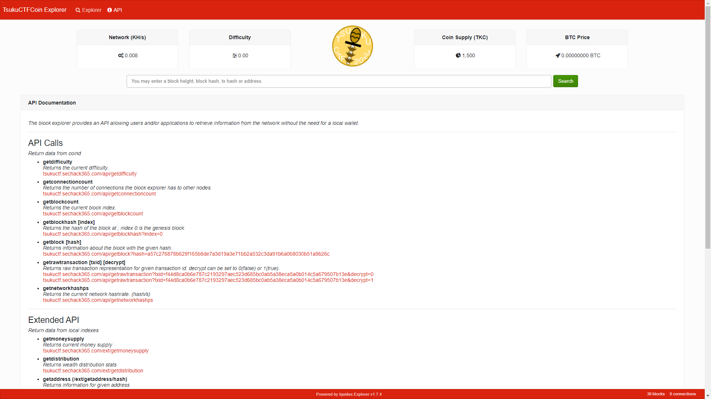
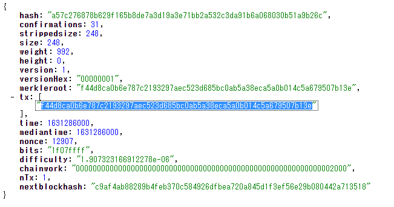

# genesis

TsukushiくんはTsukuCTFの開催記念に新しく暗号資産「TsukuCTFCoin」を作りました！(この資産は問題用に作成されたものであり、実用できるものではありません)
どうやらTsukushiくんはブロックチェーンに、フラグ形式の記念のメッセージを埋め込んだようです。
以下にブロックチェーンエクスプローラーのURLを示します。
そこから得られる情報を用いて、フラグを取得してください。

この問題では、提供されるブロックチェーンエクスプローラー以外にバイナリをテキスト(ascii)に変換する手段が必要です。

- ヒント1: ブロックチェーンについて詳しくない場合、問題に含まれる単語で検索してみるとヒントを得られるかもしれません。
- ヒント2: ブロックチェーンに含まれるブロックは、ブロックハッシュ(Block Hash)をキー、ブロックの内容をバリューとするキーバリューストアのように考えてください。
- ヒント3: メッセージはトランザクション(tx)に埋め込まれています。

https://tsukuctfcoin.sechack365.com

## 想定解法1

ヒント1が遠回しですが、「ブロックチェーン メッセージ」でGoogle検索をすると、その他の候補として「ビットコイン ジェネシスブロック メッセージ」というものが出てきます。
このワードで検索すると、例えば以下のサイトが検索結果として得られます。
https://alis.to/nonbiritokei/articles/3GqMZgbQ0wMz

上記のサイトにはジェネシスブロックは「block0」であることが記されています。
また、ジェネシスブロックにはメッセージが埋め込めることがわかります。

以上のように、何かしらの方法でジェネシスブロック(block 0)にメッセージが埋め込まれていることさえわかれば、あとはジェネシスブロックを探し出し、その中からメッセージを探し出すだけです。

Webサイト上からジェネシスブロックを探したいところですが、トップページで見られるブロックの一覧を見ても、1ブロックが限界です。

そこで、ブロックチェーンエクスプローラーが提供してくれているAPIを用います。

ヒント2には、「ブロックハッシュを元にブロックが求められる」ことが書かれています。
なので、「block0」のブロックハッシュを求めます。
API一覧からブロックハッシュを求めるものを探すと「getblockhash」が該当します。
`index`にブロックの高さを指定すればよいことが書かれているので、 https://tsukuctfcoin.sechack365.com/api/getblockhash?index=0 にアクセスすればブロックハッシュが得られます。
`a57c276878b629f165b8de7a3d19a3e71bb2a532c3da91b6a068030b51a9b26c`

次いでブロックハッシュからブロックを求めるものを探すと、「getblock」が該当します。
`hash`にブロックハッシュを指定すれば良いことが書かれているので、 https://tsukuctfcoin.sechack365.com/api/getblock?hash=a57c276878b629f165b8de7a3d19a3e71bb2a532c3da91b6a068030b51a9b26c にアクセスすればブロックのデータが得られます。

ここで詰まってしまいますが、ヒント3として、「トランザクション(tx)に注目すればいい」ということがわかります。
「getblock」のリザルトには`tx`が含まれています。これを使用します。

トランザクションを見るためのAPIは「getrawtransaction」です。
`txid`に`tx`で得られたものを代入します。
ここからは想定解法が2つに分かれます。

### 想定解法1-1 `decrypt=0`を用いる場合

getrawtransactionには、オプションとして`decrypt`という項目があります。
これは、トランザクションを分解して、見やすくする機能で、0で未適用、1で適用されます。
`decrypt=0`で得られた結果は、そのままhex to ascii変換器に投げれば、どこかにフラグが浮かび上がります。

### 想定解法1-2 `decrypt=1`を用いる場合
`decrypt=1`で得られた結果はその中からさらにフラグに該当する部分を探さなければなりません。
ここからは総当たりでもよいでしょう。
`coinbase`キーのバリューにあたる部分にフラグが含まれています。

## 想定解法2
とりあえずAPIページを見に行きます。
ご丁寧にも、APIのサンプルは全てジェネシスブロックに関連するものにしてあるので(これはたまたま当たるレベルなので、本来は)、ヒント3の「トランザクション(tx)に注目すればいい」という点から`getrawtransaction` APIをたたきます。

これ以降は想定解法1-1や1-2と同じです。

## Flag
TsukuCTF{2021_09_11_GENESIS_TKC}