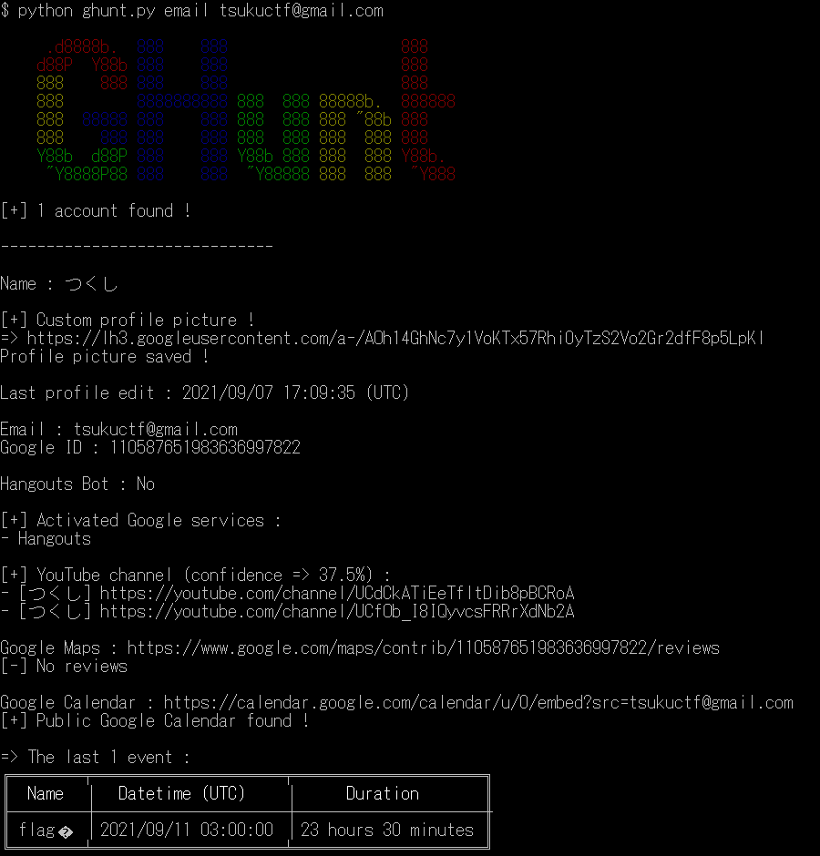
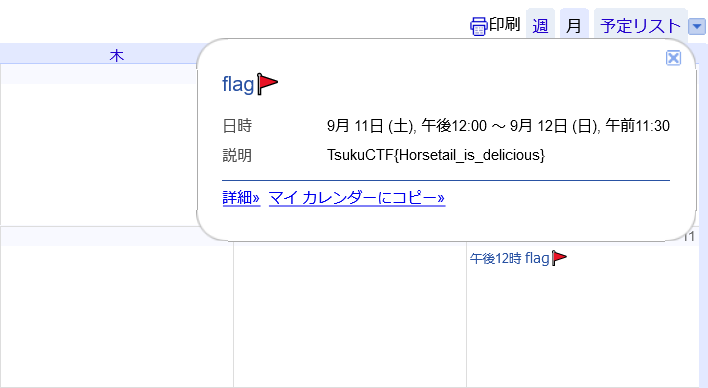

# Tsukushi_no_email2
[Tsukushi_no_email1](../tsukushi_no_email1)から`tsukuctf@gmail.com`がこのCTFのメールアドレスであることがわかる。  
Googleの情報を取得したい場合以下のツールを使用することが多い。  
GHunt  
[https://github.com/mxrch/GHunt](https://github.com/mxrch/GHunt)  
ここにメールアドレスを入れると次のような出力となる。  
  
なにか予定があることがわかる。  
  
カレンダーを出力されたURLから見るとflagが書かれていた。  

## TsukuCTF{Horsetail\_is\_delicious}
